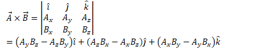
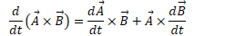

Cross Product
=============

-   Cross (vector) product of two vectors gives you a vector perpendicular to both whose magnitude is equal to the area of a parallelogram defined by the two initial vectors

  

-   Positive direction of the cross product is given by the right-hand rule

  

-   Cross product of parallel vectors is zero.

Calculating the Cross Product
=============================

-   

-   

Cross Product Properties
========================

-   

-   

-   

-   

Unites
======

  
