1.1 - What is Physics?

Monday, March 13, 2017

9:04 AM

 

Matter
======

-   Matter - anything that has mass and takes up space

-   Mass - the amount of "stuff" making up an object

    -   Stars

    -   Electrons

    -   Neil Diamond

-   Inertial Mass

    -   How hard it is to accelerate an object

-   Gravitational Mass

    -   How large a gravitational force an object experiences

Energy
======

-   Energy - The ability or capacity to do work

-   Work - the process of moving an object

Mass-Energy Equivalence
=======================

-   In the early 20th century, Albert Einstein formalized a relationship between mass and energy

-   The mass of an object, a key characteristic of matter, is really a measure of its energy

-   The source of all energy on Earth is the conversion of mass into energy

 

 

1.2 - Math Review

Monday, March 13, 2017

9:05 AM

 

Cross Product
=============

-   Cross (vector) product of two vectors gives you a vector perpendicular to both whose magnitude is equal to the area of a parallelogram defined by the two initial vectors

> 

-   Positive direction of the cross product is given by the right-hand rule

> 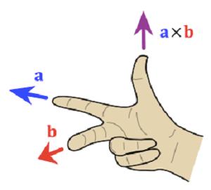

-   Cross product of parallel vectors is zero.

Calculating the Cross Product
=============================

-   

-   

Cross Product Properties
========================

-   

-   

-   

-   

Unites
======

> 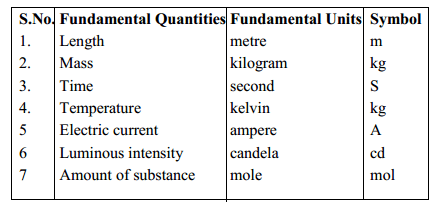

 

 

2.1 - Describing Motion I

Monday, March 13, 2017

9:06 AM

 

Position / Displacement
=======================

-   An object's position is its location at a given point in time

-   

-   

-   Position and displacement are both vectors

-   

Average Speed
=============

-   Average speed is the distance traveled divided by the time interval

-   

-   Average speed is a scalar, and is measured in meters/second

Average Velocity
================

-   Velocity is the rate at which position changes.

-   Average velocity is the displacement during a time interval divided by the time interval

-   

-   Average velocity is a vector, and is also measured in meter/second

Acceleration
============

-   Acceleration is the rate at which velocity changes

-   

-   Acceleration is a vector

-   Units are m/s2

The Position Vector
===================

> 

Average Velocity
================

> 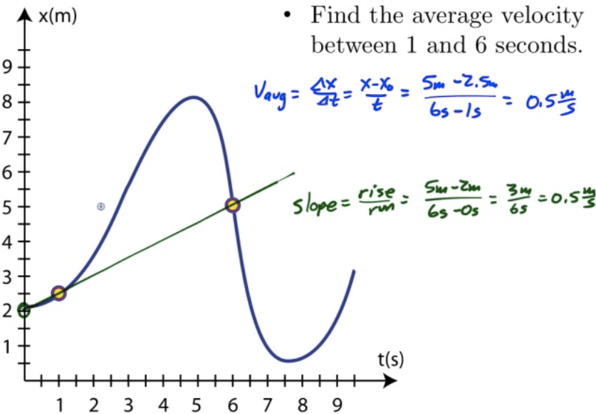

Instantaneous Velocity
======================

-   Average velocity observed over an infinitely small time interval provides instantons velocity

-   Instantaneous velocity is the derivative of position with respect to time

> 

-   Area under the velocity-time graph is the displacement during that time interval

> 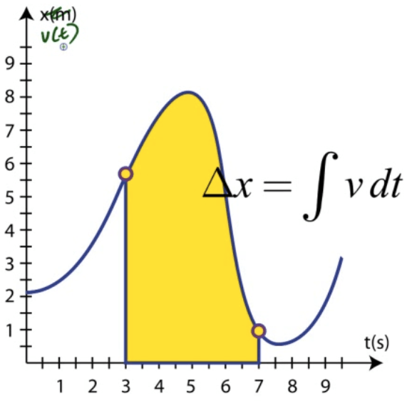

Acceleration 
=============

-   Acceleration is the rate at which velocity changes

> 

 

 

2.2 - Describing Motion II

Monday, March 13, 2017

9:06 AM

 

Special Case: Constant Acceleration
===================================

-   For cases of constant acceleration, we can derive a set of "kinematic equations" that will allow us to solve for unknown quantities

> 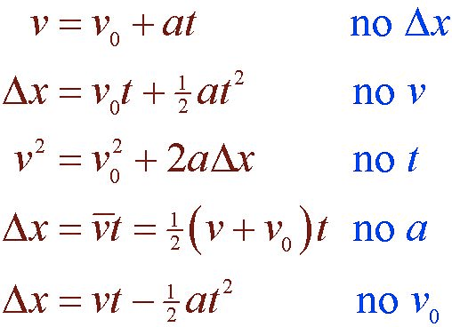

Deriving the Kinematic Equations
================================

> 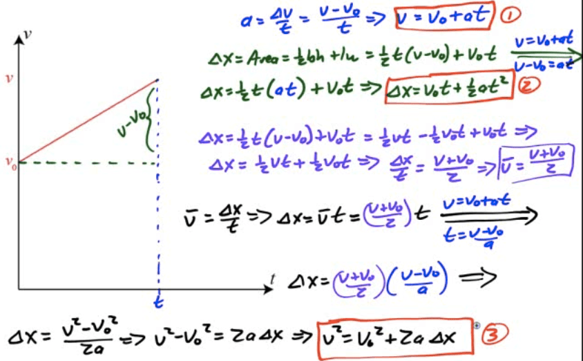

Free Fall
=========

-   When the only force acting on an object is the force of gravity, we refer to object's motion as free fall

-   This includes objects that have a non-zero initial velocity

Air Resistance
==============

-   If we drop a ball and a sheet of paper, it is obvious they don't fall at the same rate

-   If we could remove all the air from the room, however, we would find that they fall at the same rate

-   We will analyze the motion of objects by neglecting air resistance (a form of friction) for the time being

Acceleration Due to Gravity
===========================

-   Near the surface of Earth, objects accelerate downward at a rate of 9.8m/s2

-   We call this acceleration the acceleration due to gravity (g)

-   More accurately, g is referred to as the gravitational field strength

-   As you move further away from Earth, g decreases

 

 

2.3 - Projectile Motion

Monday, March 13, 2017

9:50 AM

 

What Is a Projectile
====================

-   A projectile is an object that is in acted upon only by gravity

-   In reality, air resistance plays a role

-   Typically, projectiles are objects launched at an angle

Path of a Projectile
====================

-   Projectiles launched at an angle move in parabolic arcs

> 

Independence of Motion
======================

-   Projectiles launched at an angle have motion in two dimensions

    -   Vertical - like free fall

    -   Horizontal - 0 acceleration

-   Vertical motion and horizontal motion can be treated separately!

Angled Projectiles
==================

-   For objects launched at an angle, you must first break up the object's initial velocity into x and y components of initial velocity

-   Then, use these components of initial velocity in your horizontal and vertical motion tables

-   An object will travel the maximum horizontal distance with a launch angle of 45°

> 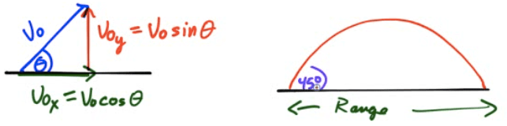

Graphing Projectile Motion
==========================

-   Track vector components as a function of time

-   Solve for time in the horizontal, and use that to eliminate time in the vertical equation

> 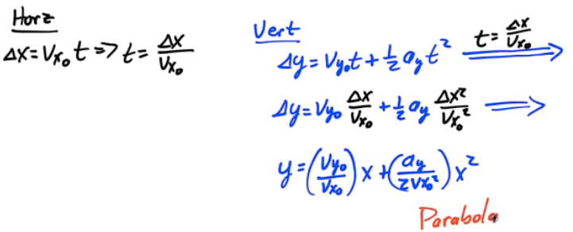

 

 

2.4 - Circular & Relative Motion

Monday, March 13, 2017

9:58 AM

 

Radians and Degrees
===================

-   In degrees, once around a circle is 360°

-   In radians, once around a circle is 2π

-   A radian measures a distance around an arc equal to the length of the arc's radius

-   

Linear vs. Angular Displacement
===============================

> 

-   

-   

-   

-   

Linear vs. Angular Velocity
===========================

> 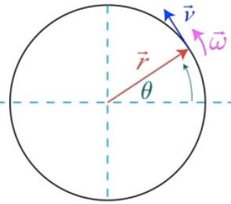

-   

-   

-   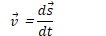

-   

Direction of Angular Velocity
=============================

Converting Linear to Angular Velocity
=====================================

> 

Linear vs. Angular Acceleration 
================================

> 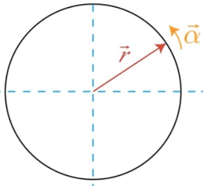

-   

-   

-   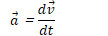

-   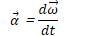

Centripetal Acceleration
========================

Reference Frames
================

-   A reference frame describes the motion of an observer

    -   Most common reference frame is Earth

-   Laws of physics we study in this course assume we're in an inertial, non-accelerating reference frame

-   There is no way to distinguish between motion at rest and motion at a constant velocity in an inertial reference frame

Calculating Relative Velocities
===============================

-   Consider two objects, A and B.

-   Calculating the velocity of A with respect of reference frame B (and vice versa) is straightforward

-   Example:

    -   Speed of car with respect to the ground

    -   Walking on a train, speed of a person with respect to the train

<!-- -->

-   

Linear vs. Angular
==================

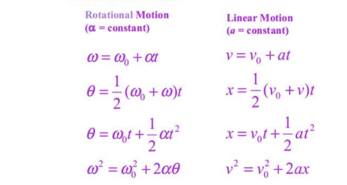

 

 

3.1 - Newton's First Law & Free Body Diagrams

Monday, March 13, 2017

10:15 AM

 

Newton's First Law of Motion
============================

-   An object at rest will remain at rest, and an object in motion will remain in motion, at constant velocity and in a straight line, un line acted upon by a net force

-   An object will continue in its current state of motion unless an unbalanced force acts upon it

-   An object at rest will remain at rest unless an unbalanced force acts upon them

-   Also known as the law of inertia

Force 
======

-   A force is a push or pull on an object

-   Unites of force are newtons (N)

-   

<table>
<thead>
<tr class="header">
<th>Contact Force</th>
<th>Field Force</th>
</tr>
</thead>
<tbody>
<tr class="odd">
<td>Tension 
Applied Force 
Friction</td>
<td>Gravity 
Electrical Force 
Magnetic Force</td>
</tr>
</tbody>
</table>

Net Force 
==========

-   A net force is the vector sum of all the forces acting on an object

-   If all forces are balanced, there is no net force. This situation is known as translational equilibrium

-   An unbalanced force is a net force

Equilibrium
===========

-   Static Equilibrium

    -   Net force on an object is 0

    -   Net torque on an object is 0

    -   Object is at rest

-   Mechanical Equilibrium

    -   Net force on an object is 0

    -   Net torque on an object is 0

-   Translational Equilibrium

    -   Net force on an object is 0

Inertia
=======

-   Inertia is the tendency of an object to resist a change in velocity

-   Mass actually has two aspects

    -   Inertial mass is how hard it is to change an object's velocity

    -   Gravitational mass is how strongly a gravitational field affects a mass

-   For the purposes of basic introductory physics, mass and inertia are synonymous

Free Body Diagrams
==================

-   Tools used to analyze physical situations

-   Show all the force acting on a single object

-   Object itself drawn as a dot or rectangle

> 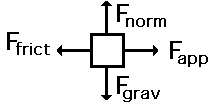

 

 

3.2 - Newton's Second & Third Laws of Motion

Monday, March 13, 2017

10:53 AM

 

Newton's Second Law of Motion
=============================

-   The acceleration of an object is in the direction of and directly proportional to the net force applied, and inversely proportional to the object's mass

-   Valid only in inertial reference frames.

-   

Mass vs. Weight
===============

-   Mass is the amount of "stuff" something is made up of.

-   It remains constant

-   Weight (mg) is the force of gravity on an object

    -   Weight varies with gravitational field strength (g)

Newton's Third Law of Motion
============================

-   All forces come in pairs. If Object 1 exerts a force on Object 2, then the Object 2 must exert a force back on Object 1, which is equal in magnitude and opposite in direction

-   

 

 

3.3 - Friction

Monday, March 13, 2017

11:02 AM

 

Coefficient of Friction
=======================

> 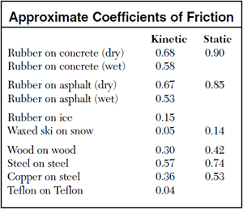

-   Ratio of the frictional force and the normal force provides the coefficient of friction

-   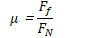

Kinetic or Static
=================

> 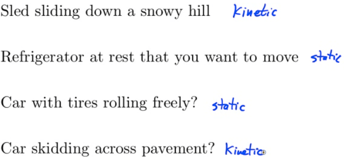

Calculating the Force of Friction
=================================

-   The force of friction depends only upon the nature of the surface in contact (μ) and magnitude of the normal force FN

-   Combine with Newton's Second Las and FBDs to solve more involved problems

2007 Free Response Question 1
=============================

> 
>
> 
>
> 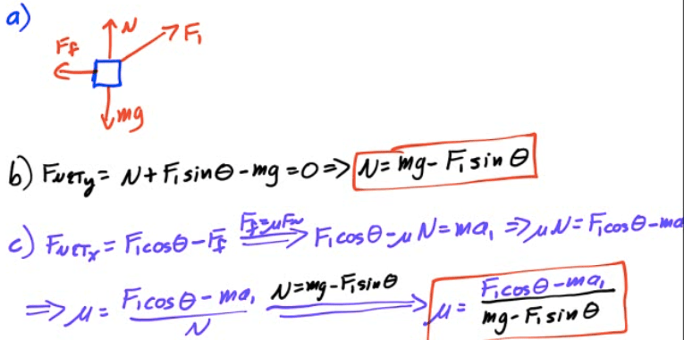
>
> 

 

 

3.4 - Retarding & Drag Forces

Monday, March 13, 2017

11:12 AM

 

Retarding Forces
================

-   Sometimes the frictional force is a function of an object's velocity (such as air resistance)

-   These forces are called drag, or retarding, forces.

The Skydiver
============

-   Assume we drop Alex from an airplane

-   

-   

> 

Velocity as a Function of Time
==============================

> 

Acceleration as a Function of Time
==================================

> 

Graph of Acceleration, Velocity, and Displacement
=================================================

> 

2005 Free Response Question 1
=============================

> 
>
> 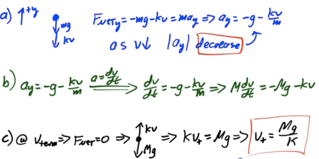
>
> 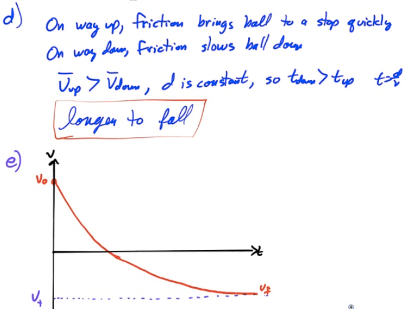

2013 Free Response Question 2
=============================

> 
>
> 
>
> 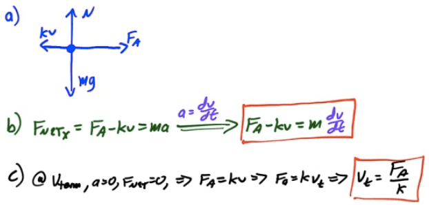
>
> 

 

 

3.5 - Ramps & Inclines

Tuesday, March 14, 2017

9:35 PM

 

Drawing FBDs for Ramps
======================

-   Choose the object of interest and draw it as a dot or box

-   Draw and label all the external forces acting on the object

-   Sketch a coordinate system, choosing the direction of the object's motion as one of the positive axes

> 

Pseudo-FBDs
===========

-   When forces don't line up with axes, you can draw a pseudo-FBD

-   Break forces that don't line up with axes into components that do

-   Redraw your diagram with all forces parallel to axes

> 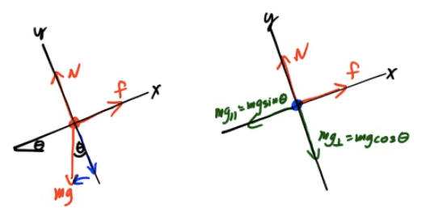

 

 

3.6 - Atwood Machines

Tuesday, March 14, 2017

9:44 PM

 

Atwood Machine
==============

-   Atwood Machine - two objects are connected by a light string over a massless pulley

-   Ideal pulleys are frictionless and massless (they add no inertia to the system)

-   Tension is constant in a light string passing over an ideal pulley

Solving Atwood Machine Problems
===============================

1.  Adopt a sign convention for positive and negative motion

2.  Draw a free body diagram for each mass

3.  Write Newton's Second Law equations for each mass

4.  Solve for unknowns

> 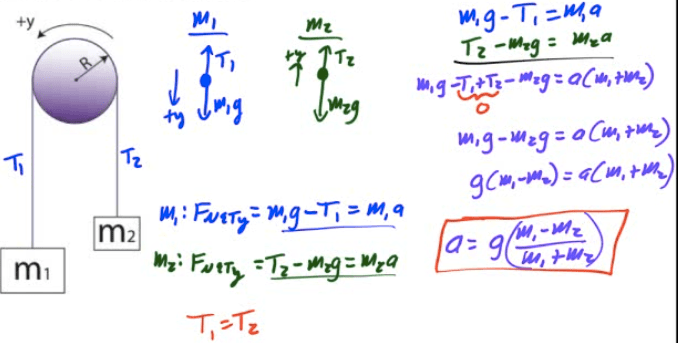

Alternate Solution
==================

-   Analyze the system as a whole

> 

Mass and Pulley on a Ramp
=========================

> 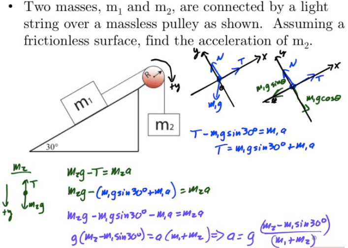

 

 

4.1 - Work

Tuesday, March 14, 2017

9:55 PM

 

What is Work?
=============

-   Work is the process of moving an object by applying a force

-   The object must move for work to be done

-   The force must cause the movement

-   Work is a scalar quantity

-   Units are Joules

Work in One Dimension
=====================

-   Only the force in the direction of the displacement contributes to the work done

> 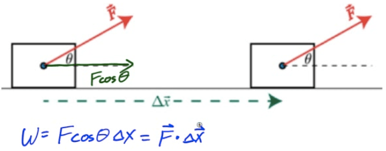

Non-Constant Forces
===================

-   Work done is the area under the force vs. displacement graph

> 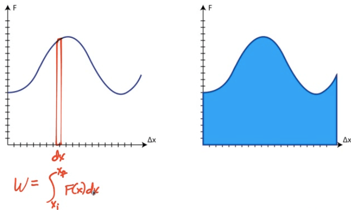

Hooke's Law
===========

-   The more you stretch or compress a string, the greater the force of the spring

-   The spring's force is opposite the direction of its displacement from equilibrium

-   Model this as a linear relationship, where the force applied by the spring is equal to a constant (the spring constant) multiplied by the spring's displacement from its equilibrium (rest) position

-   

-   Slope of the graph gives you the spring constant, k (in N/m)

> 

Work Done in Compressing a Spring
=================================

-   A spring obeys Hooke's Law. How much work is done in compressing the spring from equilibrium to some point x?

> 

Work Done in Compressing a Non-Linear Spring
============================================

> 

Work in Multiple Dimensions
===========================

> 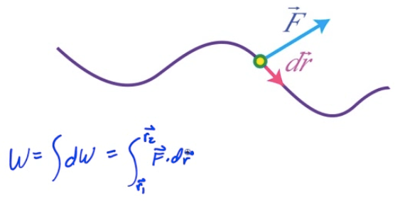

Work-Energy Theorem
===================

> 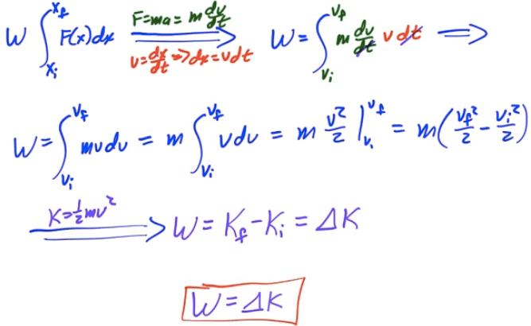

Example: Velocity from an F-d Graph
===================================

> 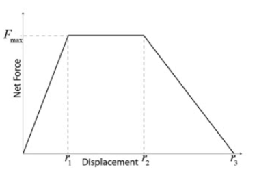

-   Determine the object's final speed.

> 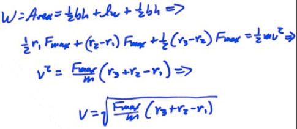

 

 

4.2 - Energy & Conservative Forces

Tuesday, March 14, 2017

10:10 PM

 

What is Energy?
===============

-   Energy is the ability or capacity to do work

    -   Work is the process of moving an object

-   Energy is the ability or capacity to move an object

Energy Transformations
======================

-   Energy can be transformed from one type to another

-   You can transfer energy from one object to another by doing work

-   Work-Energy Theorem

    -   Work done on a system by an external force changes the energy of the system

Kinetic Energy
==============

-   Kinetic Energy is energy of motion

    -   The ability or capacity of a moving object to move another object

-   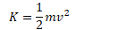

Potential Energy
================

-   Potential Energy (U) is energy an object possesses due to its position or state of being

    -   Gravitational Potential Energy (Ug) is the energy an object possesses because of its position in a gravitational field

    -   Elastic Potential Energy (Us)

    -   Chemical Potential Energy

    -   Electric Potential Energy

    -   Nuclear Potential Energy

-   A single object can have only kinetic energy, as potential energy requires an interaction between objects

Internal Energy
===============

-   The internal energy of a system include the kinetic energy of the objects that make up the system and the potential energy of the configuration of the objects that make up the system

-   Changes in a system's structure can result in changes in internal energy

Gravitational Potential Energy (Ug)
==============================================

> 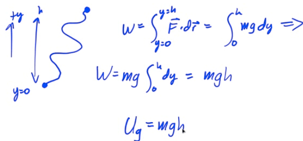

Conservative Forces 
====================

-   A force in which the work done on an object is independent of the path taken is known as conservative force

-   A force in which the work done moving along a closed path is zero

-   A force in which the work done is directly related to a negative change in potential energy (W=-ΔU)

<table>
<thead>
<tr class="header">
<th>Conservative Forces</th>
<th>Non-Conservative Forces</th>
</tr>
</thead>
<tbody>
<tr class="odd">
<td>
Gravity 
Elastic Forces

Coulombic Forces
</td>
<td>Friction 
Drag 
Air Resistance</td>
</tr>
</tbody>
</table>

Newton's Law of Universal Gravitation
=====================================

-   The gravitational force of attraction between any two objects with mass

-   

> 

Force from Potential Energy
===========================

> 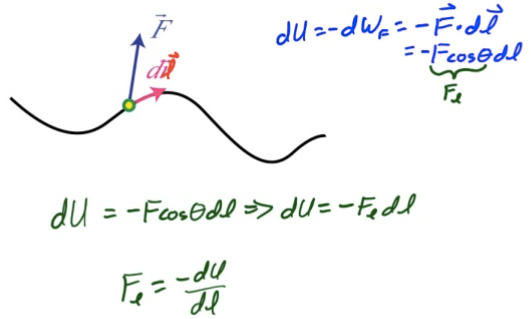

Summary
=======

> 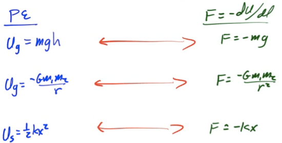

 

 

4.3 - Conservation of Energy

Wednesday, March 15, 2017

11:05 AM

 

Conservation of Mechanical Energy
=================================

-   Consider a single conservative force doing work on a closed system

-   

-   

-   

Non-Conservative Forces
=======================

-   Non-conservative forces change the total mechanical energy of a system, but not the total energy of a system

-   Work done by a non-conservative force is typically converted to internal (thermal) energy

-   

-   

2002 Free Response Question 3
=============================

> 
>
> 
>
> 

2007 Free Response Question 3
=============================

> 
>
> 
>
> 
>
> 

2010 Free Response Question 1
=============================

> 
>
> 
>
> 
>
> 
>
> 

2013 Free Response Question 1
=============================

> 
>
> 
>
> 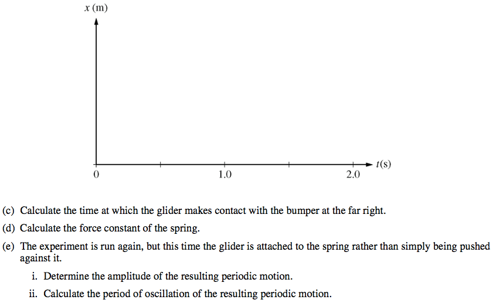
>
> 

 

 

4.4 - Power

Wednesday, March 15, 2017

11:05 AM

 

Defining Power
==============

-   Power is the rate at which work is done

-   Power is the rate at which a force does work

-   Units of power are joules/second, or watts

-   

-   

2003 Free Response Question 1
=============================

> 
>
> 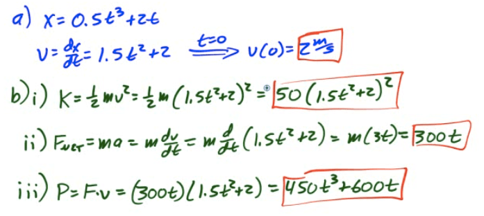
>
> 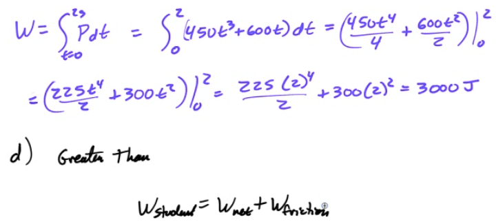

 

 

5.1 - Momentum & Impulse

Wednesday, March 15, 2017

11:05 AM

 

Momentum
========

-   Momentum is a vector describing how difficult it is to stop a moving object

-   Total momentum is the sum of individual momenta

-   

-   Units are kg·m/s or N·s

Example 1: Changing Momentum
============================

-   An Aichi D3A bomber mass (3600 kg) departs from its aircraft carrier with a velocity of 85 m/s due east. What is its momentum?

> 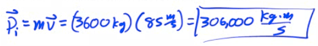

-   After it drops its payload, its new mass is 3000 kg and it attains a cruising speed of 120 m/s . What is its new momentum?

> 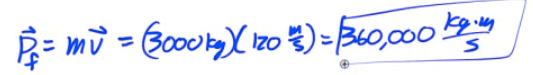

Impulse
=======

-   As you observed in the previous problem, momentum can change

-   A change in momentum is known as an impulse (J)

-   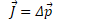

Example 2: Impulse
==================

-   The D3A bomber, which had a momentum of 3.6e5 kg·m/s, comes to halt on the ground. What impulse is applied?

> 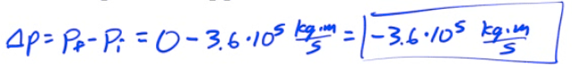

Relationship Between Force and Impulse
======================================

-   

Example 3: Force from Momentum
==============================

-   The momentum of an object as a function of time is given by p=kt2, where k is a constant. What is the equation for the force causing this motion?

> 

Impulse-Momentum Theorem
========================

> 

Example 4: Impulse-Momentum
===========================

-   A 6-kg block, sliding to the east across a horizontal, frictionless surface with a momentum of 30 kg·m/s, strikes an obstacle. The obstacle exerts an impulse of 10 N·s to the west on the block. Find the speed of the block after the collision.

> 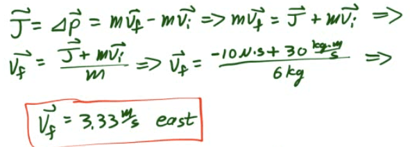

Example 5: Water Gun
====================

-   A girl with a water gun shoots a stream of water than ejects 0.2 kg of water per second horizontally at a speed of 10 m/s. What horizontal force must the girl apply on the gun in order to hold it in position?

> 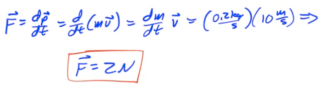

Impulse from F-t Graphs 
========================

-   Impulse is the area under a Force-time graph

-   Impulse is equivalent to a change in momentum

> 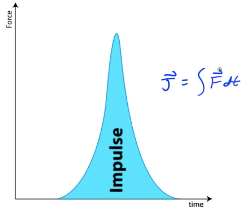

Example 6: Impulse from Force
=============================

-   A force F(t)=t3 is applied to a 10 kg mass. What is the total impulse applied to the object between 1 and 3 seconds?

> 

 

 

5.2 - Conservation of Linear Momentum

Wednesday, March 15, 2017

11:05 AM

 

Collisions and Explosions
=========================

-   In the case of a collision or explosion, if you add up the individual momentum vectors of all the objects before the event, you'll find that they are equal to the sum of momentum vectors of the objects after the event

-   Written mathematically, the law of conservation of linear momentum states

-   

Solving Momentum Problems
=========================

1.  Identify all the objects in the system

2.  Determine the momenta of the objects before the event. Use variables for any unknowns

3.  Determine the momenta of the objects after the event. Use variables for any unknowns

4.  Add up all the momenta from before the event and set equal to the momenta after the event

5.  Solve for any unknowns

Types of Collisions
===================

> 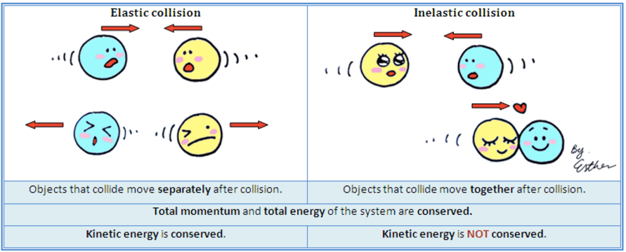

-   Elastic collision

    -   Kinetic energy is conserved

-   Inelastic collision

    -   Kinetic energy is not conserved

Example 1: Traffic Collision
============================

-   A 2000-kg car traveling 20 m/s collides with a 1000-kg car at rest. If the 2000-kg car has a velocity of 6.67 m/s after the collision, find the velocity of the 1000-kg car after the collision

> 

Example 2: Collision of Two Moving Objects
==========================================

-   On a snow-covered road, a car with a mass of 1100 kg collides head-on with a van having a mass of 2500 kg traveling at 8 m/s

-   As a result of the collision, the vehicles lock together and immediately come to rest.

-   Calculate the speed of the car immediately before the collision

> 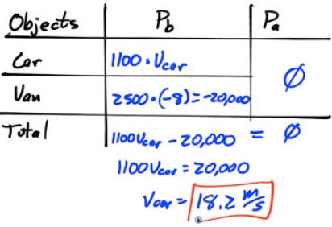

Example 3: Recoil Velocity
==========================

-   A 4-kg rifle fires a 20-gram bullet with a velocity of 300 m/s. Find the recoil velocity of the rifle

> 

Example 4: Atomic Collision
===========================

-   A proton (mass=m) and a lithium nucleus (mass=7m) undergo an elastic collision as shown below.

-   Find the velocity of the lithium nucleus following the collision

> 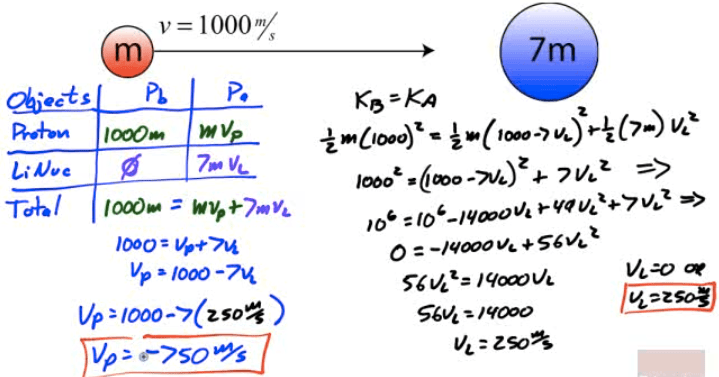

Example 5: Collisions in Multiple Dimensions
============================================

-   Bert strikes a cur ball of mass 0.17 kg , giving it a velocity of 3 m/s in the x-direction. When the cue ball strikes the eight ball (mass=0.16kg), previously at rest, the eight ball is deflected 45 degrees from the cur ball's previous path, and the cue ball is deflected 40 degrees in the opposite direction. Find the velocity of the cue ball and the eight ball after the collision

> 
>
> 

2001 Free Response Question 1
=============================

> 
>
> 

2002 Free Response Question 1
=============================

> 
>
> 
>
> 
>
> 

2014 Free Response Question 1
=============================

> 
>
> 
>
> 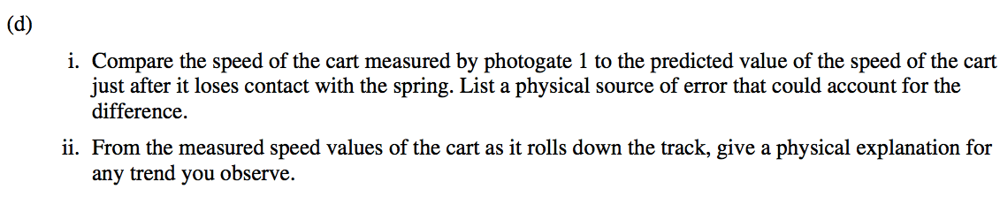
>
> 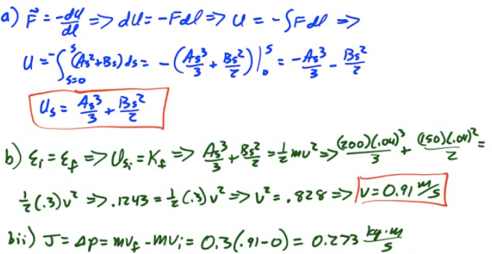
>
> 

 

 

5.3 - Center of Mass

Wednesday, March 15, 2017

11:05 AM

 

Center of Mass
==============

-   Real objects are more complex than theoretical particles

-   Treat entire object as if its entire mass were contained at a single point known as the object's center of mass (CM)

-   Center of mass is the weighted average of the location of mass in an object

Find CM by Inspection
=====================

-   For uniform density objects, CM is the geometric center

-   For objects with multiple parts, find CM of each part and treat as a point

-   For irregular objects, suspend object from two or more points and drop a plumb line. The line intersects at the center of mass

> 

Calculating CM for Systems of Particles
=======================================

-   

-   

-   

Example 1: Center of Mass (1D)
==============================

> 

Example 2: CM of Continuous System
==================================

> 

Example 3: Center of Mass (2D)
==============================

> 

Finding CM by Integration
=========================

-   For more complex objects, you can find the center of mass by summing up all the little pieces of position vectors multiplied by the differential of mass and dividing by the total mass

-   

Example 4: CM of a Uniform Rod
==============================

> 

Example 5: CM of a Non-Uniform Rod
==================================

-   Find the center of mass of a non-uniform rod of length L and mass M whose density is given by λ=kx

> 

Center of Mass Relationships
============================

> 

Center of Gravity
=================

-   Center of Gravity refers to the location at which the force of gravity acts upon an object as if it were a point particle with all its mass focused at that point

-   In a uniform gravitational field, Center of Gravity and Center of Mass are the same

-   In a non-uniform gravitational field, they may be different

2004 Free Response Question 1
=============================

> 
>
> 
>
> 
>
> 

 

 

6.1 - Uniform Circular Motion

Wednesday, March 15, 2017

11:06 AM

 

Uniform Circular Motion
=======================

-   Object travels in a circular path at constant speed

-   Distance around the circle is its circumference

    -   

-   Average speed formula from kinematics still applies

    -   

Frequency
=========

-   Frequency is the number of revolutions or cycles which occur each second

-   Symbol is f

-   Units are 1/s, or Hertz (Hz)

-   

Period 
=======

-   Period is the time it takes for one complete revolution, or cycle.

-   Symbol is T

-   Unites are seconds (s)

-   T = time for 1 cycle = time for 1 revolution

Frequency and Period
====================

-   

-   

Centripetal Acceleration
========================

-   Is an object undergoing UCM accelerating?

> 
>
> 

-   Magnitude of Centripetal Acceleration

    -   

Centripetal Force
=================

-   If an object is traveling in a circle it is accelerating toward the center of the circle

-   For an object to accelerate, there must be a net force

-   

-   

 

 

7.1 - Rotational Kinematics

Wednesday, March 15, 2017

8:21 PM

 

Radians and Degrees
===================

-   In degrees, once around a circle is 360°

-   In radians, once around a circle is 2π

-   A radian measures a distance around an arc equal to the length of the arc's radius

-   

Linear vs. Angular Displacement
===============================

> 

-   

-   

-   

-   

Linear vs. Angular Velocity
===========================

> 

-   

-   

-   

-   

Direction of Angular Velocity
=============================

> 

Converting Linear to Angular Velocity
=====================================

> 

Linear vs. Angular Acceleration 
================================

> 

-   

-   

-   

-   

Kinematic Variable Parallels
============================

| Variable     | Translational | Angular |
|--------------|---------------|---------|
| Displacement | Δs            | Δθ      |
| Velocity     | v             | ⍵       |
| Acceleration | a             | ⍺       |
| Time         | t             | t       |

Variable Translations
=====================

| Variable     | Translational                                                                                                                        | Angular                                                                                                                             |
|--------------|--------------------------------------------------------------------------------------------------------------------------------------|-------------------------------------------------------------------------------------------------------------------------------------|
| Displacement |  |  |
| Velocity     |  |  |
| Acceleration |  |  |
| Time         |   |  |

Kinematic Equation Parallels
============================

> 

Centripetal Acceleration
========================

> 

Example: Wheel in Motion
========================

-   A wheel of radius r and mass M undergoes a constant angular acceleration of magnitude ⍺.

-   What is the speed of the wheel after it has completed on complete turn, assuming it started from rest?

> 

2003 Free Response Question 3
=============================

> 
>
> 
>
> 
>
> 
>
> 

2014 Free Response Question 2
=============================

> 
>
> 
>
> 
>
> 

 

 

7.2 - Moment of Inertia

Wednesday, March 15, 2017

8:21 PM

 

Types of Inertia
================

-   Inertial mass / translational inertia (M) is an object's ability to resist a linear acceleration

-   Moment of Inertia / rotational inertia (I) is an object's resistance to a rational acceleration

-   Objects that have most of their mass near their axis of rotation have smaller rotational inertias than objects with more mass farther from their axis of rotation

Kinetic Energy of a Rotating Disc
=================================

> 

Calculating Moment of Inertia (I)
=================================

-   

> 

Example 1: Point Masses
=======================

-   Find the moment of inertia (I) of two 5-kg bowling balls joined by a meter-long rod of negligible mass when rotated about the center of the rod.

-   Compare this to the moment of inertia of the object when rotated about one of the mass

> 

Example 2: Uniform Rod
======================

-   Find the moment of inertia of a uniform rod about its end and about its center

> 

Example 3: Solid Cylinder
=========================

-   Find the moment of inertia of a uniform solid cylinder about its axis

> 

Parallel Axis Theorem (PAT)
===========================

-   If the moment of inertia (I) of any object through an axis intersecting the center of mass of the object is l, you can find the moment of inertia around any axis parallel to the current axis of rotation (l')

> 
>
> 

Example 4: Calculating I Using PAT
==================================

-   Find the moment of inertia of a uniform rod about its end

> 

Example 5: Hollow Sphere
========================

-   Calculate the moment of inertia of a hollow sphere with a mass of 10 kg and a radius of 0.2 meter

> 

Example 6: Adjusting Moment of Inertia
======================================

-   A uniform rod of length L has moment of inertia I0 when rotated about its midpoint.

-   A sphere of mass M is added to each end of the rod.

-   What is the new moment of inertia of the rod/ball system?

> 

 

 

7.3 - Torque

Thursday, March 16, 2017

11:31 PM

 

Torque (τ)
==========

-   Torque is a force that causes an object to turn

-   Torque must be perpendicular to the displacement to cause a rotation

-   The further away the force is applied from the point of rotation, the more leverage you obtain, so this distance is known as the lever arm (r)

> 

-   

-   

Direction of the Torque Vector
==============================

-   The direction of the torque vector is perpendicular to both the position vector and the force vector

-   You can find the direction using the right-hand rule. Point the fingers of your right hand in the direction of the line of action, and bend you fingers in the direction of the force

-   You thumb then points in the direction of your torque

-   Note that positive torques cause counter-clockwise rotation, and negative torques cause clockwise rotation

Newton's Second Law: Translational vs. Rotational
=================================================

-   

-   

Equilibrium
===========

-   Static Equilibrium implies that the net force and the net torque are zero, and the system is at rest

-   Dynamic Equilibrium implies that the net force and the net torque are zero, and the system is moving at constant translational and rotational velocity

Example 1: See-Saw Problem
==========================

-   A 10-kg tortoise sits on a see-saw 1 meter from the fulcrum.

-   Where must a 2-kg hare sit in order to maintain static equilibrium?

-   What is the force on the fulcrum?

> 

Example 2: Beam Problem 
========================

-   

-   Find the beam's angular acceleration

> 
>
> 

Example 3: Pulley with Mass
===========================

-   A light string attached to a mass m is wrapped around a pulley of mass mp and radius R. Find the acceleration of the mass

> 
>
> 
>
> 

Example 4: Net Torque
=====================

-   A system of three wheels fixed to each other is free to rotate about an axis through its center. Forces are exerted on the wheels as shown. What is the magnitude of the net torque on the wheels?

> 

Example 5: Café Sign
====================

-   A 3-kg café sign is hung from a 1-kg horizontal pole as shown. A wire is attached to prevent the sign from rotating.

-   Find the tension in the wire

> 

2008 Free Response Question 2
=============================

> 
>
> 
>
> 
>
> 

 

 

7.4 - Rotational Dynamics

Thursday, March 16, 2017

11:32 PM

 

Conservational of Energy
========================

> 

Example 1: Disc Rolling Down an Incline
=======================================

-   Find the speed of a disc of radius R which starts at rest and rolls down an incline of height H

> 

Rotational Dynamics
===================

> 

Example 2: Strings with Massive Pulleys
=======================================

-   Two blocks are connected by a light string over a pulley of mass mp and radius R.

-   Find the acceleration of mass m2 if m1 stis on a frictionless surface

> 

Example 3: Rolling Without Slipping
===================================

-   A disc of radius R rolls down an incline of angle θ without slipping.

-   Find the force of friction on the disc

> 

Example 4: Rolling with Slipping
================================

-   A bowling ball of mass M and radius R skids horizontally down the alley with an initial velocity of v0. Find the distance the ball skids before rilling given a coefficient of kenetic friction μk

> 
>
> 

Example 5: Amusement Park Swing
===============================

-   An amusement park ride of radius x allows children to sit in a spinning swing held by a cable of length L.

-   At maximum angular speed, the cable makes an angle of θ with the vertical as shown in the diagram below

-   Determine the maximum angular speed of the rider in terms of g, θ, x and L.

> 
>
> 

2002 Free Response Question 2
=============================

> 
>
> 

2006 Free Response Question 3
=============================

> 
>
> 
>
> 

2010 Free Response Question 2
=============================

> 
>
> 
>
> 

2013 Free Response Question 3
=============================

> 
>
> 
>
> 

 

 

7.5 - Angular Momentum

Thursday, March 16, 2017

11:32 PM

 

Linear Momentum
===============

-   Momentum is a vector describing how difficult it is to stop a moving object

-   Total momentum is the sum of individual momenta

-   

-   Units are kg·m/s or N·s

Angular Momentum
================

-   

-   Total angular momentum is the sum of individual angular momenta

-   

-   Units are kg·m2/s

Calculating Angular Momentum
============================

-   

> 

Spin Angular Momentum
=====================

-   For an object rotating about its center of mass

    -   

-   This is known as an object's spin angular momentum

-   Spin angular momentum is constant regardless of your reference point

Example 1: Object in Circular Orbit
===================================

-   Find the angular momentum of a planet orbiting the sun. Assume a perfectly circular orbit

> 

Example 2: Angular Momentum of a Point Particle
===============================================

> 

-   Find the angular momentum for a 5-kg point particle located at (2,2) with a velocity of 2 m/s east

-   About point O at (0,0)

> 

-   About point P at (2,0)

> 

-   About point Q at (0,2)

> 

Angular Momentum and Net Torque
===============================

> 

Conservation of Angular Momentum
================================

-   Spin angular momentum, the product of an object's moment of inertia and its angular velocity about the center of mass, is conserved in a closed system with no external net toques applied

    -   

Example 3: Ice Skater Problem
=============================

-   An ice skater spins with a specific angular velocity. She brings her arms and legs closer to her body, reducing her moment of inertia to half its original value. What happens to her angular velocity? What happens to her rotational kinetic energy?

> 

Example 4: Combining Spinning Discs
===================================

-   A disc with moment of inertia 1 km·m2 spins about an axle through its center of mass with angular velocity 10 rad/s. An identical disc which is not rotating is slide along the axle until it makes contact with the first disc.

-   If the two discs stick together, what is their combined angular velocity?

> 

Example 5: Catching While Rotating
==================================

-   Angelina spins on a rotating pedestal with an angular velocity of 8 radians per second.

-   Bob throws her an exercise ball, which increases her moment of inertia from 2 kg·m2 to 2.5 kg·m2

-   What is Angelina's angular velocity after catching the exercise ball? (Neglect any external torque from the ball)

> 

2005 Free Response Question 3
=============================

> 
>
> 
>
> 

2014 Free Response Question 3
=============================

> 
>
> 
>
> 
>
> 

 

 

8.1 - Oscillations

Thursday, March 16, 2017

11:32 PM

 

Simple Harmonic Motion
======================

-   Simple harmonic motion (SHM) is motion in which a restoring force is directly proportional to the displacement of an object

-   Nature's response to a perturbation or disturbance is often SHM

Circular Motion vs. SHM
=======================

> 

Position, Velocity, Acceleration
================================

> 

Frequency and Period
====================

-   Frequency

    -   Frequency is the number of revolutions or cycles which occur each second

    -   Symbol is f

    -   Units are 1/s, or Hertz (Hz)

    -   

-   Period

    -   Period is the time it takes for one complete revolution, or cycle.

    -   Symbol is T

    -   Unites are seconds (s)

    -   T = time for 1 cycle = time for 1 revolution

-   Relationship

    -   

    -   

Angular Frequency
=================

-   Angular frequency is the number of radians per second, and it corresponds to the angular velocity for an object traveling in uniform circular motion

-   Relationship

    -   

    -   

    -   

Example 1: Oscillating System
=============================

-   An oscillating system is created by a releasing an object from a maximum displacement of 0.2 meters. The object makes 60 complete oscillations in one minute

-   Determine the object's angular frequency

> 

-   What is the object's position at time t=10s?

> 

-   At what time is the object at x=0.1m?

> 

Mass on a Spring
================

> 

Example 2: Analysis of Spring-Block System
==========================================

-   A 5-kg block is attached to a 2000 N/m spring as shown and displaced a distance of 8 cm from its equilibrium position before being released.

-   Determine the period of oscillation, the frequency, and the angular frequency for the block

> 

General Form of SHM
===================

> 

Graphing SHM
============

> 

Energy of SHM
=============

-   When an object undergoes SHM, kinetic and potential energy both vary with time, although total energy (E=K+U) remains constant

> 

Horizontal Spring Oscillator
============================

> 

Vertical Spring Oscillator
==========================

> 

Springs in Series
=================

> 

Springs in Parallel
===================

> 

The Pendulum
============

-   A mass m is attached to a light string that swings without friction about the vertical equilibrium position

> 

Energy and the Simple Pendulum
==============================

> 
>
> 

Frequency and Period of a Pendulum
==================================

> 

Period of a Physical Pendulum
=============================

> 

Example 3: Deriving Period of a Simple Pendulum
===============================================

> 

Example 4: Deriving Period of a Physical Pendulum
=================================================

> 

Example 5: Summary of Spring-Block System
=========================================

> 

Example 6: Harmonic Oscillator Analysis
=======================================

-   A 2-kg block is attacked to a spring. A force of 20 N stretches the spring to a displacement of 0.5 meter

-   The spring constant

> 

-   The total energy

> 

-   The speed at the equilibrium position

> 

-   The speed at x=0.30 meters

> 

-   The speed at x=-0.4 meters

> 

-   The acceleration at the equilibrium position

> 

-   The magnitude of the acceleration at x=0.5 meters.

> 

-   The net force at equilibrium position

> 

-   The net force at x=0.25 meter

> 

-   Where does kinetic energy = potential energy

> 

Example 7: Vertical Spring Block Oscillator
===========================================

> 

-   A 2-kg block attached to an un-stretched spring of spring constant k=200 N/m as shown in the diagram below is released from rest. Determine the period of the block's oscillation and the maximum displacement of the block from its equilibrium while undergoing simple harmonic motion.

> 

2009 Free Response Question 2
=============================

> 
>
> 
>
> 

2010 Free Response Question 3
=============================

> 
>
> 
>
> 
>
> 

 

 

9.1 - Gravity & Orbits

Thursday, March 16, 2017

11:32 PM

 

Newton's Law of Universal Gravitation
=====================================

> 

Gravitational Field Strength
============================

> 

Gravitational Field of a Hollow Shell
=====================================

-   Inside a hollow sphere, the gravitational field is 0. Outside a hollow sphere, you can treat the sphere as if it's entire mass was concentrated at the center, and then calculate the gravitational field

> 

Gravitational Field Inside a Solid Shell
========================================

-   Outside a solid sphere, treat the sphere as if all the mass is at the center of the sphere. Inside the sphere, treat the sphere as if the mass inside the radius is all at the center. Only the mass inside the "radius of interest" counts

> 

Velocity in Circular Orbit
==========================

> 

Period and Frequency for Circular Orbits
========================================

> 

Mechanical Energy for Circular Orbits
=====================================

> 

Escape Velocity
===============

> 

Kepler's Frist Law of Planetary Motion
======================================

-   The orbits of planetary bodies are ellipses with the sun at one of two foci of the ellipse

> 

Kepler's Second Law of Planetary Motion
=======================================

-   If you were to draw a line from the sun to the orbiting body, the body would sweep out equal areas along the ellipse in equal amounts of time.

> 

Kepler's Third Law of Planetary Motion
======================================

-   The ratio of the squares of the periods of two planets is equal to the ratio of the cubes of their semi-major axes.

-   The ratio of the squares of the periods to the cubes of their semi-major axes is referred to as Kepler's Constant

> 

Total Mechanical Energy for an Elliptical Orbit
===============================================

> 

Velocity and Radius for an Elliptical Orbit
===========================================

> 

Example 1: Rocket Launched Vertically
=====================================

-   A rocket is launched vertically form the surface of the Earth with an initial velocity of 10 km/s. What maximum height does it reach, neglecting air resistance?

-   Note that the mass of the Earth (m1) is 6\*1024 kg and the radius of the Earth (RE) is 6.37\*106 m. You may not assume that the acceleration due to gravity is constant.

> 

2007 Free Response Question 2
=============================

> 
>
> 
>
> 

 

 

Sample Questions

Wednesday, April 5, 2017

5:57 PM

 

Question 6
==========

> 
>
> 

 

 

1998 Multiple Choice

Thursday, March 23, 2017

11:00 PM

 

Question 17
===========

> 

Question 20
===========

> 
>
> 

Question 33
===========

> 
>
> 

 

 

2004 Multiple Choice

Wednesday, April 19, 2017

12:58 AM

 

Question 8
==========

> 
>
> 

Question 17
===========

> 

-   No net external torque --&gt; no change in angular momentum

-   No net external force --&gt; no change in linear momentum

Question 25
===========

> 

-   After ball tossed it has momentum toward back so the boat must have forward momentum to maintain the zero initial momentum.

-   After the catch both the ball and boat the two must be at the same speed and this must be at rest to have momentum zero as it was originally

Question 29
===========

> 

-   Neither the mass, M, nor the spring constant, k, depend on the gravitational force of the planet.

Question 33
===========

> 
>
> 
>
> 

Question 34
===========

> 

-   The path of a point on the rim of a non-slipping rolling wheel is a cycloid.

> 

Question 35
===========

-   Escape speed

> 

-   Orbital speed

> 

 

 

2009 Multiple Choice

Wednesday, April 19, 2017

1:11 AM

 

Question 7
==========

> 

Question 11
===========

> 
>
> 

Question 19
===========

> 

-   When a=0, μ= tanθ

Question 21
===========

> 

-   After the person has walked to the other end, the situation must be the mirror image of this one; the center of mass will be shifted to a distance d to the left of the center of the raft.

-   But the center of mass cannot move as the person walks on the boat.

-   Therefore, the boat must have moved a distance 2d to the right.

Question 24
===========

> 
>
> 
>
> 

Question 25
===========

> 
>
> 

Question 32
===========

> 

-   The center of mass cannot move

 

 

Free Response 1999-2001

2017年5月8日 星期一

上午1:38

 

1999 Free Response
==================

Question 3
----------

> 
>
> 
>
> 
>
> 

2000 Free Response
==================

Question 2
----------

> 
>
> 
>
> 
>
> 
>
> 

2001 Free Response
==================

Question 2
----------

> 
>
> 
>
> 

Question 3
----------

> 
>
> 
>
> 
>
> 
>
> 
>
> 
>
> 

 

 

Free Response 2002-2004

2017年5月8日 星期一

上午1:38

 

2002 Free Response
==================

Question 2
----------

> 
>
> 
>
> 

Question 3
----------

> 
>
> 

2003 Free Response
==================

Question 2
----------

> 
>
> 
>
> 

Question 3
----------

> 
>
> 
>
> 
>
> 

2004 Free Response
==================

Question 1
----------

> 
>
> 
>
> 
>
> 
>
> 
>
> 
>
> 

Question 3
----------

> 
>
> 
>
> 
>
> 
>
> 

 

 

Free Response 2005-2007

2017年5月8日 星期一

上午1:38

 

2005 Free Response
==================

Question 3
----------

> 
>
> 
>
> 
>
> 
>
> 
>
> 
>
> 

2006 Free Response
==================

Question 3
----------

> 
>
> 
>
> 
>
> 

2007 Free Response
==================

Question 2
----------

> 
>
> 
>
> 
>
>  

 

 

Free Response 2008-2010

2017年5月8日 星期一

上午1:38

 

2008 Free Response
==================

Question 1
----------

> 
>
> 
>
> 

Question 3
----------

> 
>
> 
>
> 
>
> 

2009 Free Response
==================

Question 1
----------

> 
>
> 

Question 2
----------

> 
>
> 
>
> 

2010 Free Response
==================

Question 3
----------

> 
>
> 
>
> 
>
> 
>
> 

 

 

Free Response 2011-2013

2017年5月8日 星期一

上午1:38

 

2011 Free Response
==================

Question 1
----------

> 
>
> 
>
> 
>
> 
>
> 
>
> 
>
> 

2012 Free Response
==================

Question 2
----------

> 
>
> 
>
> 
>
> 
>
> 

Question 3
----------

> 
>
> 
>
> 

2013 Free Response
==================

Question 3
----------

> 
>
> 
>
> 
>
> 
>
> 
>
>  

 

 

Free Response 2014-2016

2017年5月8日 星期一

上午1:38

 

2014 Free Response
==================

Question 1
----------

> 
>
> 
>
> 

Question 2
----------

> 
>
> 
>
> 

Question 3
----------

> 
>
> 
>
> 
>
> 
>
> 

2015 Free Response
==================

Question 1
----------

> 
>
> 
>
> 
>
> 
>
> 

Question 3
----------

> 
>
> 
>
> 
>
> 
>
> 
>
> 

2016 Free Response
==================

Question 2
----------

> 
>
> 
>
> 
>
> 
>
> 
