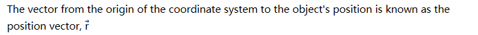
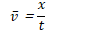
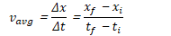
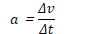
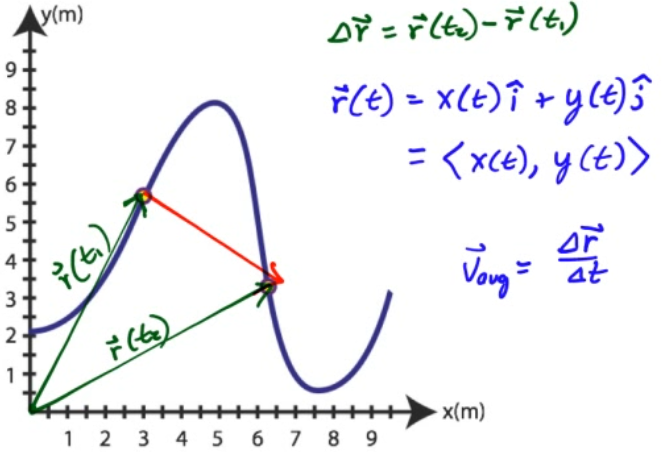
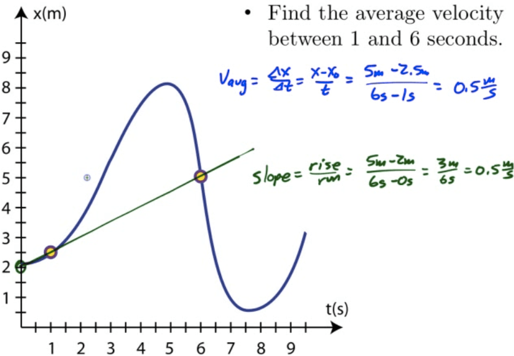
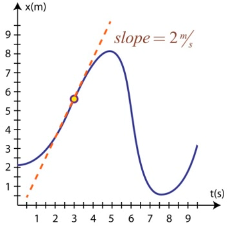
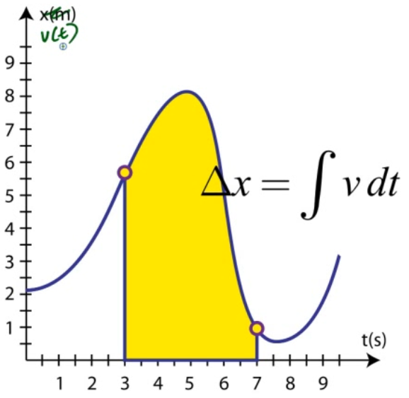
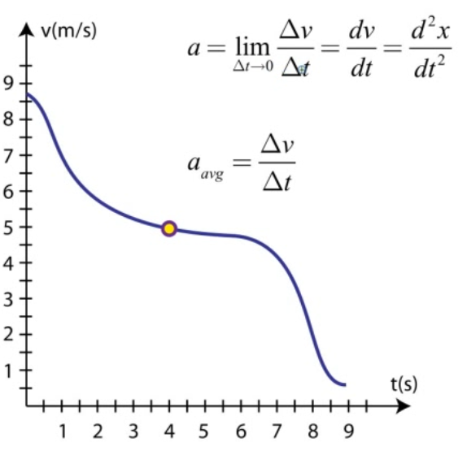

Position / Displacement
=======================

-   An object's position is its location at a given point in time

-   

-   

-   Position and displacement are both vectors

-   

Average Speed
=============

-   Average speed is the distance traveled divided by the time interval

-   

-   Average speed is a scalar, and is measured in meters/second

Average Velocity
================

-   Velocity is the rate at which position changes.

-   Average velocity is the displacement during a time interval divided by the time interval

-   

-   Average velocity is a vector, and is also measured in meter/second

Acceleration
============

-   Acceleration is the rate at which velocity changes

-   

-   Acceleration is a vector

-   Units are m/s2

The Position Vector
===================

  

Average Velocity
================

  

Instantaneous Velocity
======================

-   Average velocity observed over an infinitely small time interval provides instantons velocity

-   Instantaneous velocity is the derivative of position with respect to time

  

-   Area under the velocity-time graph is the displacement during that time interval

  

Acceleration 
=============

-   Acceleration is the rate at which velocity changes

  
