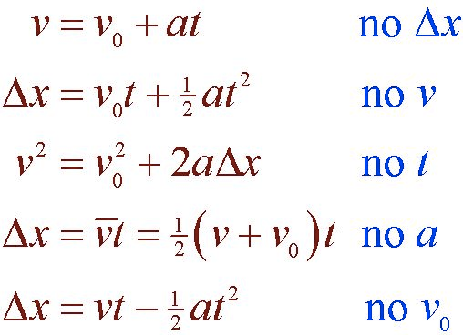
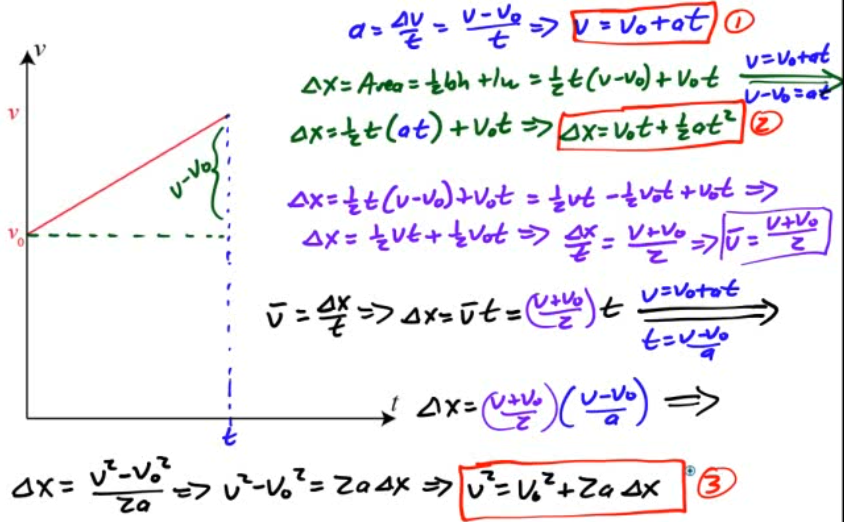

Special Case: Constant Acceleration
===================================

-   For cases of constant acceleration, we can derive a set of "kinematic equations" that will allow us to solve for unknown quantities

  

Deriving the Kinematic Equations
================================

  

Free Fall
=========

-   When the only force acting on an object is the force of gravity, we refer to object's motion as free fall

-   This includes objects that have a non-zero initial velocity

Air Resistance
==============

-   If we drop a ball and a sheet of paper, it is obvious they don't fall at the same rate

-   If we could remove all the air from the room, however, we would find that they fall at the same rate

-   We will analyze the motion of objects by neglecting air resistance (a form of friction) for the time being

Acceleration Due to Gravity
===========================

-   Near the surface of Earth, objects accelerate downward at a rate of 9.8m/s2

-   We call this acceleration the acceleration due to gravity (g)

-   More accurately, g is referred to as the gravitational field strength

-   As you move further away from Earth, g decreases