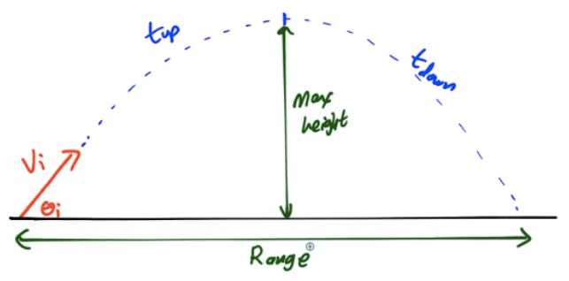

What Is a Projectile
====================

-   A projectile is an object that is in acted upon only by gravity

-   In reality, air resistance plays a role

-   Typically, projectiles are objects launched at an angle

Path of a Projectile
====================

-   Projectiles launched at an angle move in parabolic arcs

  

Independence of Motion
======================

-   Projectiles launched at an angle have motion in two dimensions

    -   Vertical - like free fall

    -   Horizontal - 0 acceleration

-   Vertical motion and horizontal motion can be treated separately!

Angled Projectiles
==================

-   For objects launched at an angle, you must first break up the object's initial velocity into x and y components of initial velocity

-   Then, use these components of initial velocity in your horizontal and vertical motion tables

-   An object will travel the maximum horizontal distance with a launch angle of 45°

  

Graphing Projectile Motion
==========================

-   Track vector components as a function of time

-   Solve for time in the horizontal, and use that to eliminate time in the vertical equation

  