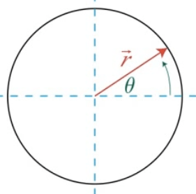

Radians and Degrees
===================

-   In degrees, once around a circle is 360°

-   In radians, once around a circle is 2π

-   A radian measures a distance around an arc equal to the length of the arc's radius

-   

Linear vs. Angular Displacement
===============================

  

-   

-   

-   

-   

Linear vs. Angular Velocity
===========================

  

-   

-   

-   

-   

Direction of Angular Velocity
=============================

Converting Linear to Angular Velocity
=====================================

  

Linear vs. Angular Acceleration 
================================

  

-   

-   

-   

-   

Centripetal Acceleration
========================

Reference Frames
================

-   A reference frame describes the motion of an observer

    -   Most common reference frame is Earth

-   Laws of physics we study in this course assume we're in an inertial, non-accelerating reference frame

-   There is no way to distinguish between motion at rest and motion at a constant velocity in an inertial reference frame

Calculating Relative Velocities
===============================

-   Consider two objects, A and B.

-   Calculating the velocity of A with respect of reference frame B (and vice versa) is straightforward

-   Example:

    -   Speed of car with respect to the ground

    -   Walking on a train, speed of a person with respect to the train

<!-- -->

-   

Linear vs. Angular
==================

