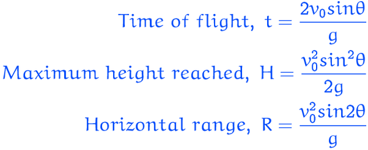
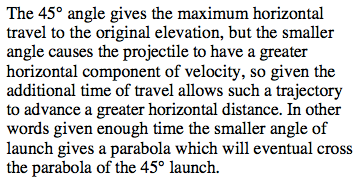

Question 8
==========

  

  

Question 17
===========

  

-   No net external torque --&gt; no change in angular momentum

-   No net external force --&gt; no change in linear momentum

Question 25
===========

  

-   After ball tossed it has momentum toward back so the boat must have forward momentum to maintain the zero initial momentum.

-   After the catch both the ball and boat the two must be at the same speed and this must be at rest to have momentum zero as it was originally

Question 29
===========

  

-   Neither the mass, M, nor the spring constant, k, depend on the gravitational force of the planet.

Question 33
===========

  

  

  

Question 34
===========

  

-   The path of a point on the rim of a non-slipping rolling wheel is a cycloid.

  

Question 35
===========

-   Escape speed

  

-   Orbital speed

  