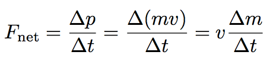
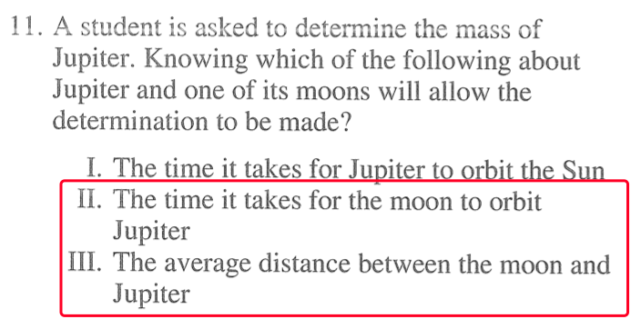
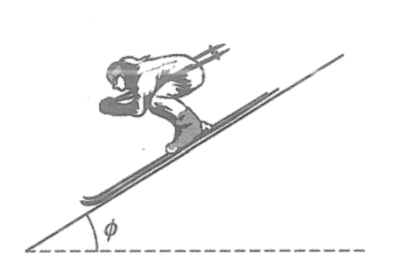
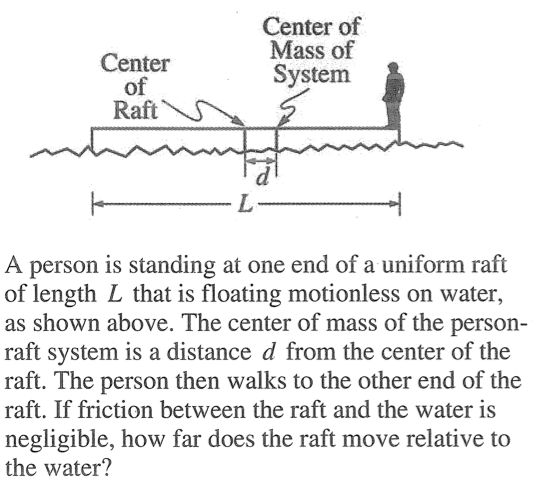
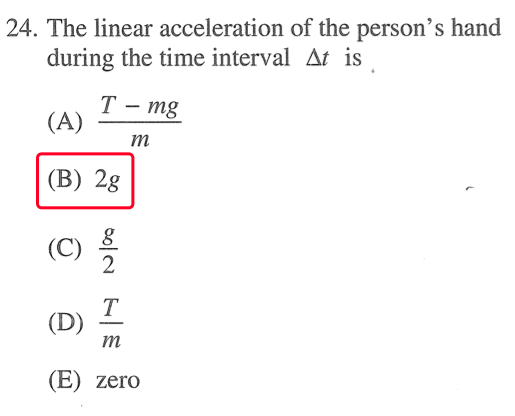
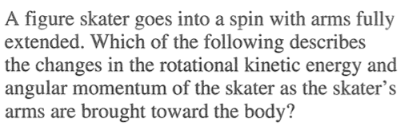
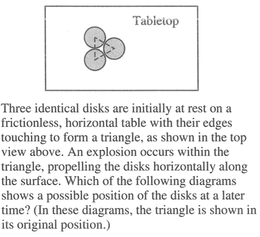

Question 7
==========

  

Question 11
===========

  

  

Question 19
===========

  

-   When a=0, μ= tanθ

Question 21
===========

  

-   After the person has walked to the other end, the situation must be the mirror image of this one; the center of mass will be shifted to a distance d to the left of the center of the raft.

-   But the center of mass cannot move as the person walks on the boat.

-   Therefore, the boat must have moved a distance 2d to the right.

Question 24
===========

  

  

  

Question 25
===========

  

  

Question 32
===========

  

-   The center of mass cannot move