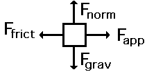

Newton's First Law of Motion
============================

-   An object at rest will remain at rest, and an object in motion will remain in motion, at constant velocity and in a straight line, un line acted upon by a net force

-   An object will continue in its current state of motion unless an unbalanced force acts upon it

-   An object at rest will remain at rest unless an unbalanced force acts upon them

-   Also known as the law of inertia

Force 
======

-   A force is a push or pull on an object

-   Unites of force are newtons (N)

-   

<table>
<thead>
<tr class="header">
<th>Contact Force</th>
<th>Field Force</th>
</tr>
</thead>
<tbody>
<tr class="odd">
<td>Tension 
Applied Force 
Friction</td>
<td>Gravity 
Electrical Force 
Magnetic Force</td>
</tr>
</tbody>
</table>

Net Force 
==========

-   A net force is the vector sum of all the forces acting on an object

-   If all forces are balanced, there is no net force. This situation is known as translational equilibrium

-   An unbalanced force is a net force

Equilibrium
===========

-   Static Equilibrium

    -   Net force on an object is 0

    -   Net torque on an object is 0

    -   Object is at rest

-   Mechanical Equilibrium

    -   Net force on an object is 0

    -   Net torque on an object is 0

-   Translational Equilibrium

    -   Net force on an object is 0

Inertia
=======

-   Inertia is the tendency of an object to resist a change in velocity

-   Mass actually has two aspects

    -   Inertial mass is how hard it is to change an object's velocity

    -   Gravitational mass is how strongly a gravitational field affects a mass

-   For the purposes of basic introductory physics, mass and inertia are synonymous

Free Body Diagrams
==================

-   Tools used to analyze physical situations

-   Show all the force acting on a single object

-   Object itself drawn as a dot or rectangle

  