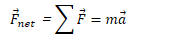
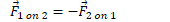

Newton's Second Law of Motion
=============================

-   The acceleration of an object is in the direction of and directly proportional to the net force applied, and inversely proportional to the object's mass

-   Valid only in inertial reference frames.

-   

Mass vs. Weight
===============

-   Mass is the amount of "stuff" something is made up of.

-   It remains constant

-   Weight (mg) is the force of gravity on an object

    -   Weight varies with gravitational field strength (g)

Newton's Third Law of Motion
============================

-   All forces come in pairs. If Object 1 exerts a force on Object 2, then the Object 2 must exert a force back on Object 1, which is equal in magnitude and opposite in direction

-   