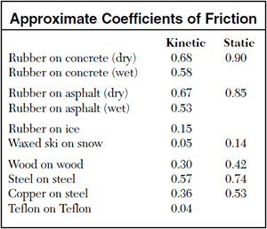
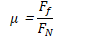
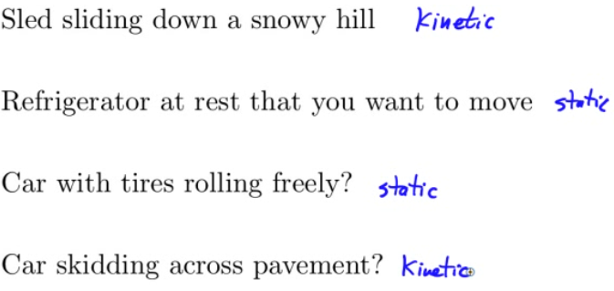
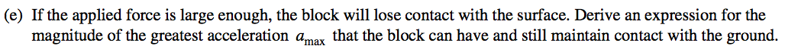
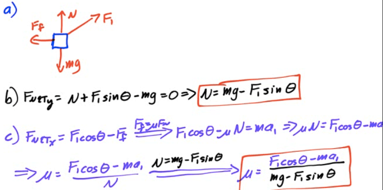
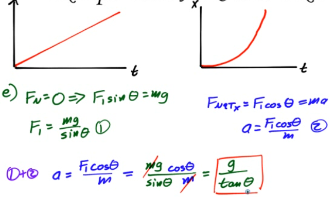

Coefficient of Friction
=======================

  

-   Ratio of the frictional force and the normal force provides the coefficient of friction

-   

Kinetic or Static
=================

  

Calculating the Force of Friction
=================================

-   The force of friction depends only upon the nature of the surface in contact (μ) and magnitude of the normal force FN

-   Combine with Newton's Second Las and FBDs to solve more involved problems

2007 Free Response Question 1
=============================

  

  

  

  