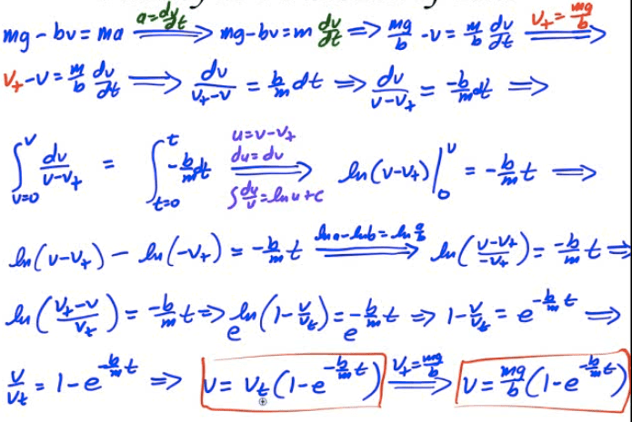
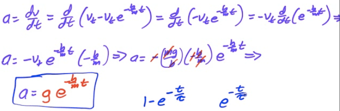

Retarding Forces
================

-   Sometimes the frictional force is a function of an object's velocity (such as air resistance)

-   These forces are called drag, or retarding, forces.

The Skydiver
============

-   Assume we drop Alex from an airplane

-   

-   

  

Velocity as a Function of Time
==============================

  

Acceleration as a Function of Time
==================================

  

Graph of Acceleration, Velocity, and Displacement
=================================================

  

2005 Free Response Question 1
=============================

  

  

  

2013 Free Response Question 2
=============================

  

  

  

  