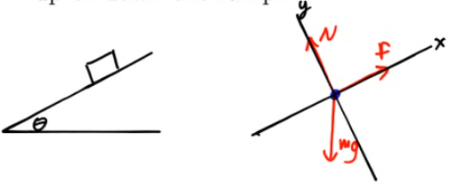
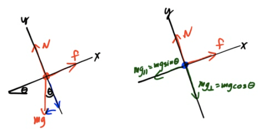

Drawing FBDs for Ramps
======================

-   Choose the object of interest and draw it as a dot or box

-   Draw and label all the external forces acting on the object

-   Sketch a coordinate system, choosing the direction of the object's motion as one of the positive axes

  

Pseudo-FBDs
===========

-   When forces don't line up with axes, you can draw a pseudo-FBD

-   Break forces that don't line up with axes into components that do

-   Redraw your diagram with all forces parallel to axes

  