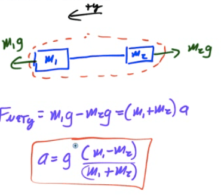

Atwood Machine
==============

-   Atwood Machine - two objects are connected by a light string over a massless pulley

-   Ideal pulleys are frictionless and massless (they add no inertia to the system)

-   Tension is constant in a light string passing over an ideal pulley

Solving Atwood Machine Problems
===============================

1.  Adopt a sign convention for positive and negative motion

2.  Draw a free body diagram for each mass

3.  Write Newton's Second Law equations for each mass

4.  Solve for unknowns

  

Alternate Solution
==================

-   Analyze the system as a whole

  

Mass and Pulley on a Ramp
=========================

  
