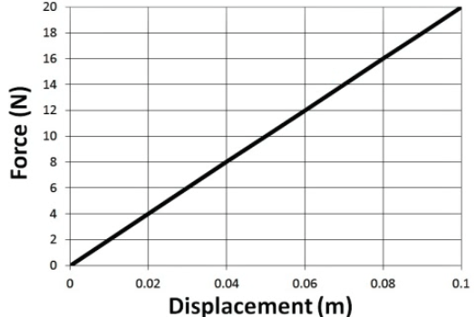

What is Work?
=============

-   Work is the process of moving an object by applying a force

-   The object must move for work to be done

-   The force must cause the movement

-   Work is a scalar quantity

-   Units are Joules

Work in One Dimension
=====================

-   Only the force in the direction of the displacement contributes to the work done

  

Non-Constant Forces
===================

-   Work done is the area under the force vs. displacement graph

  

Hooke's Law
===========

-   The more you stretch or compress a string, the greater the force of the spring

-   The spring's force is opposite the direction of its displacement from equilibrium

-   Model this as a linear relationship, where the force applied by the spring is equal to a constant (the spring constant) multiplied by the spring's displacement from its equilibrium (rest) position

-   

-   Slope of the graph gives you the spring constant, k (in N/m)

  

Work Done in Compressing a Spring
=================================

-   A spring obeys Hooke's Law. How much work is done in compressing the spring from equilibrium to some point x?

  

Work Done in Compressing a Non-Linear Spring
============================================

  

Work in Multiple Dimensions
===========================

  

Work-Energy Theorem
===================

  

Example: Velocity from an F-d Graph
===================================

  

-   Determine the object's final speed.

  