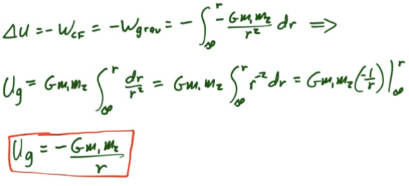

What is Energy?
===============

-   Energy is the ability or capacity to do work

    -   Work is the process of moving an object

-   Energy is the ability or capacity to move an object

Energy Transformations
======================

-   Energy can be transformed from one type to another

-   You can transfer energy from one object to another by doing work

-   Work-Energy Theorem

    -   Work done on a system by an external force changes the energy of the system

Kinetic Energy
==============

-   Kinetic Energy is energy of motion

    -   The ability or capacity of a moving object to move another object

-   

Potential Energy
================

-   Potential Energy (U) is energy an object possesses due to its position or state of being

    -   Gravitational Potential Energy (Ug) is the energy an object possesses because of its position in a gravitational field

    -   Elastic Potential Energy (Us)

    -   Chemical Potential Energy

    -   Electric Potential Energy

    -   Nuclear Potential Energy

-   A single object can have only kinetic energy, as potential energy requires an interaction between objects

Internal Energy
===============

-   The internal energy of a system include the kinetic energy of the objects that make up the system and the potential energy of the configuration of the objects that make up the system

-   Changes in a system's structure can result in changes in internal energy

Gravitational Potential Energy (Ug)
==============================================

  

Conservative Forces 
====================

-   A force in which the work done on an object is independent of the path taken is known as conservative force

-   A force in which the work done moving along a closed path is zero

-   A force in which the work done is directly related to a negative change in potential energy (W=-ΔU)

<table>
<thead>
<tr class="header">
<th>Conservative Forces</th>
<th>Non-Conservative Forces</th>
</tr>
</thead>
<tbody>
<tr class="odd">
<td>
Gravity 
Elastic Forces

Coulombic Forces
</td>
<td>Friction 
Drag 
Air Resistance</td>
</tr>
</tbody>
</table>

Newton's Law of Universal Gravitation
=====================================

-   The gravitational force of attraction between any two objects with mass

-   

  

Force from Potential Energy
===========================

  

Summary
=======

  