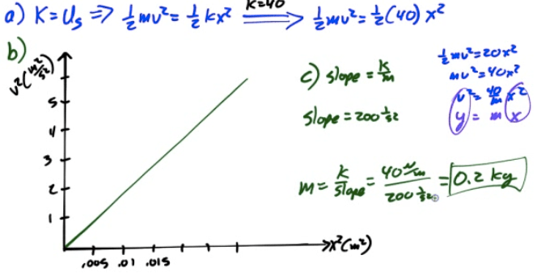
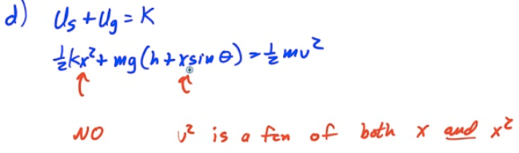
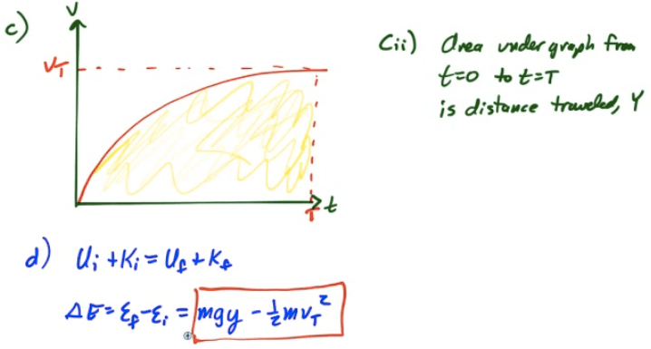

Conservation of Mechanical Energy
=================================

-   Consider a single conservative force doing work on a closed system

-   

-   

-   

Non-Conservative Forces
=======================

-   Non-conservative forces change the total mechanical energy of a system, but not the total energy of a system

-   Work done by a non-conservative force is typically converted to internal (thermal) energy

-   

-   

2002 Free Response Question 3
=============================

  

  

  

2007 Free Response Question 3
=============================

  

  

  

  

2010 Free Response Question 1
=============================

  

  

  

  

  

2013 Free Response Question 1
=============================

  

  

  

  