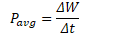
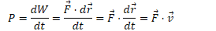

Defining Power
==============

-   Power is the rate at which work is done

-   Power is the rate at which a force does work

-   Units of power are joules/second, or watts

-   

-   

2003 Free Response Question 1
=============================

  

  

  