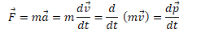

Momentum
========

-   Momentum is a vector describing how difficult it is to stop a moving object

-   Total momentum is the sum of individual momenta

-   

-   Units are kg·m/s or N·s

Example 1: Changing Momentum
============================

-   An Aichi D3A bomber mass (3600 kg) departs from its aircraft carrier with a velocity of 85 m/s due east. What is its momentum?

  

-   After it drops its payload, its new mass is 3000 kg and it attains a cruising speed of 120 m/s . What is its new momentum?

  

Impulse
=======

-   As you observed in the previous problem, momentum can change

-   A change in momentum is known as an impulse (J)

-   

Example 2: Impulse
==================

-   The D3A bomber, which had a momentum of 3.6e5 kg·m/s, comes to halt on the ground. What impulse is applied?

  

Relationship Between Force and Impulse
======================================

-   

Example 3: Force from Momentum
==============================

-   The momentum of an object as a function of time is given by p=kt2, where k is a constant. What is the equation for the force causing this motion?

  

Impulse-Momentum Theorem
========================

  

Example 4: Impulse-Momentum
===========================

-   A 6-kg block, sliding to the east across a horizontal, frictionless surface with a momentum of 30 kg·m/s, strikes an obstacle. The obstacle exerts an impulse of 10 N·s to the west on the block. Find the speed of the block after the collision.

  

Example 5: Water Gun
====================

-   A girl with a water gun shoots a stream of water than ejects 0.2 kg of water per second horizontally at a speed of 10 m/s. What horizontal force must the girl apply on the gun in order to hold it in position?

  

Impulse from F-t Graphs 
========================

-   Impulse is the area under a Force-time graph

-   Impulse is equivalent to a change in momentum

  

Example 6: Impulse from Force
=============================

-   A force F(t)=t3</sup  is applied to a 10 kg mass. What is the total impulse applied to the object between 1 and 3 seconds?

  