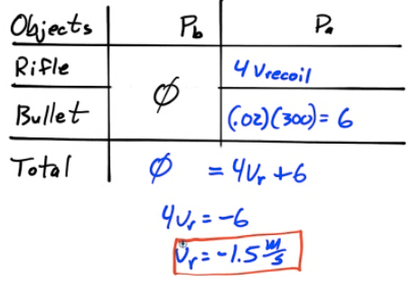
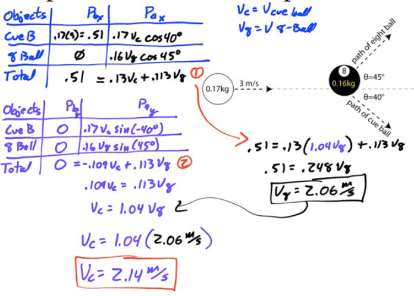
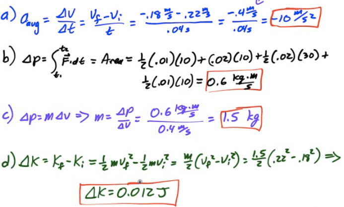
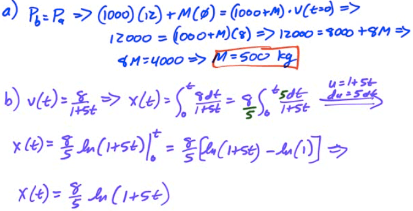
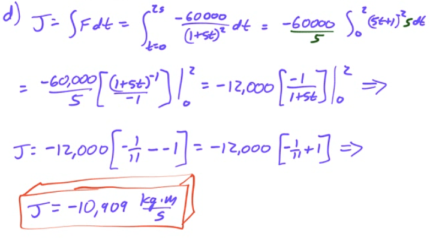
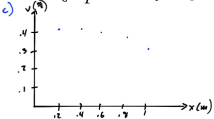

Collisions and Explosions
=========================

-   In the case of a collision or explosion, if you add up the individual momentum vectors of all the objects before the event, you'll find that they are equal to the sum of momentum vectors of the objects after the event

-   Written mathematically, the law of conservation of linear momentum states

-   

Solving Momentum Problems
=========================

1.  Identify all the objects in the system

2.  Determine the momenta of the objects before the event. Use variables for any unknowns

3.  Determine the momenta of the objects after the event. Use variables for any unknowns

4.  Add up all the momenta from before the event and set equal to the momenta after the event

5.  Solve for any unknowns

Types of Collisions
===================

  

-   Elastic collision

    -   Kinetic energy is conserved

-   Inelastic collision

    -   Kinetic energy is not conserved

Example 1: Traffic Collision
============================

-   A 2000-kg car traveling 20 m/s collides with a 1000-kg car at rest. If the 2000-kg car has a velocity of 6.67 m/s after the collision, find the velocity of the 1000-kg car after the collision

  

Example 2: Collision of Two Moving Objects
==========================================

-   On a snow-covered road, a car with a mass of 1100 kg collides head-on with a van having a mass of 2500 kg traveling at 8 m/s

-   As a result of the collision, the vehicles lock together and immediately come to rest.

-   Calculate the speed of the car immediately before the collision

  

Example 3: Recoil Velocity
==========================

-   A 4-kg rifle fires a 20-gram bullet with a velocity of 300 m/s. Find the recoil velocity of the rifle

  

Example 4: Atomic Collision
===========================

-   A proton (mass=m) and a lithium nucleus (mass=7m) undergo an elastic collision as shown below.

-   Find the velocity of the lithium nucleus following the collision

  

Example 5: Collisions in Multiple Dimensions
============================================

-   Bert strikes a cur ball of mass 0.17 kg , giving it a velocity of 3 m/s in the x-direction. When the cue ball strikes the eight ball (mass=0.16kg), previously at rest, the eight ball is deflected 45 degrees from the cur ball's previous path, and the cue ball is deflected 40 degrees in the opposite direction. Find the velocity of the cue ball and the eight ball after the collision

  

  

2001 Free Response Question 1
=============================

  

  

2002 Free Response Question 1
=============================

  

  

  

  

2014 Free Response Question 1
=============================

  

  

  

  

  