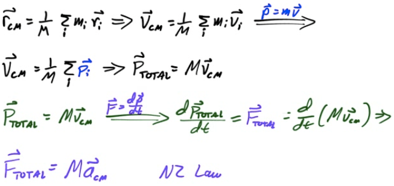
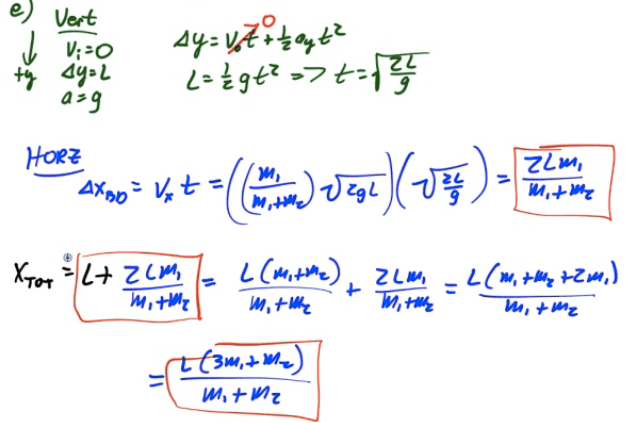

Center of Mass
==============

-   Real objects are more complex than theoretical particles

-   Treat entire object as if its entire mass were contained at a single point known as the object's center of mass (CM)

-   Center of mass is the weighted average of the location of mass in an object

Find CM by Inspection
=====================

-   For uniform density objects, CM is the geometric center

-   For objects with multiple parts, find CM of each part and treat as a point

-   For irregular objects, suspend object from two or more points and drop a plumb line. The line intersects at the center of mass

  

Calculating CM for Systems of Particles
=======================================

-   

-   

-   

Example 1: Center of Mass (1D)
==============================

  

Example 2: CM of Continuous System
==================================

  

Example 3: Center of Mass (2D)
==============================

  

Finding CM by Integration
=========================

-   For more complex objects, you can find the center of mass by summing up all the little pieces of position vectors multiplied by the differential of mass and dividing by the total mass

-   

Example 4: CM of a Uniform Rod
==============================

  

Example 5: CM of a Non-Uniform Rod
==================================

-   Find the center of mass of a non-uniform rod of length L and mass M whose density is given by λ=kx

  

Center of Mass Relationships
============================

  

Center of Gravity
=================

-   Center of Gravity refers to the location at which the force of gravity acts upon an object as if it were a point particle with all its mass focused at that point

-   In a uniform gravitational field, Center of Gravity and Center of Mass are the same

-   In a non-uniform gravitational field, they may be different

2004 Free Response Question 1
=============================

  

  

  

  