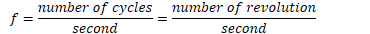
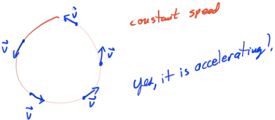
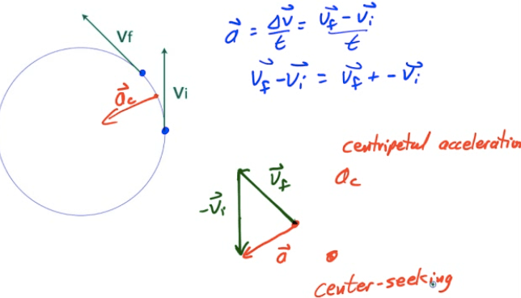
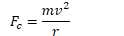

Uniform Circular Motion
=======================

-   Object travels in a circular path at constant speed

-   Distance around the circle is its circumference

    -   

-   Average speed formula from kinematics still applies

    -   

Frequency
=========

-   Frequency is the number of revolutions or cycles which occur each second

-   Symbol is f

-   Units are 1/s, or Hertz (Hz)

-   

Period 
=======

-   Period is the time it takes for one complete revolution, or cycle.

-   Symbol is T

-   Unites are seconds (s)

-   T = time for 1 cycle = time for 1 revolution

Frequency and Period
====================

-   

-   

Centripetal Acceleration
========================

-   Is an object undergoing UCM accelerating?

  

  

-   Magnitude of Centripetal Acceleration

    -   

Centripetal Force
=================

-   If an object is traveling in a circle it is accelerating toward the center of the circle

-   For an object to accelerate, there must be a net force

-   

-   