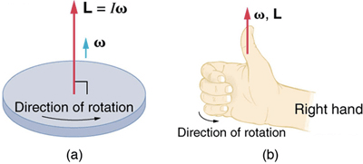
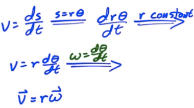
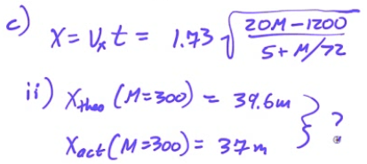
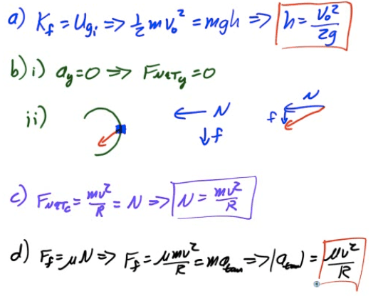

Radians and Degrees
===================

-   In degrees, once around a circle is 360°

-   In radians, once around a circle is 2π

-   A radian measures a distance around an arc equal to the length of the arc's radius

-   

Linear vs. Angular Displacement
===============================

  

-   

-   

-   

-   

Linear vs. Angular Velocity
===========================

  

-   

-   

-   

-   

Direction of Angular Velocity
=============================

  

Converting Linear to Angular Velocity
=====================================

  

Linear vs. Angular Acceleration 
================================

  

-   

-   

-   

-   

Kinematic Variable Parallels
============================

| Variable     | Translational | Angular |
| ------------ | ------------- | ------- |
| Displacement | Δs            | Δθ      |
| Velocity     | v             | ⍵       |
| Acceleration | a             | ⍺       |
| Time         | t             | t       |

Variable Translations
=====================

| Variable     | Translational                                                                                              | Angular                                                                                                    |
| ------------ | ---------------------------------------------------------------------------------------------------------- | ---------------------------------------------------------------------------------------------------------- |
| Displacement | 

Example: Wheel in Motion
========================

-   A wheel of radius r and mass M undergoes a constant angular acceleration of magnitude ⍺.

-   What is the speed of the wheel after it has completed on complete turn, assuming it started from rest?

  

2003 Free Response Question 3
=============================

  

  

  

  

  

2014 Free Response Question 2
=============================

  

  

  

  