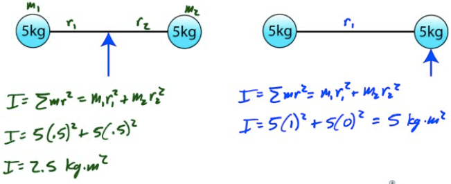
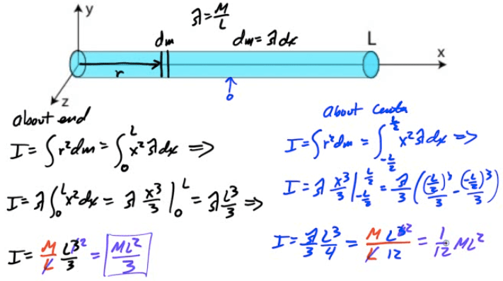
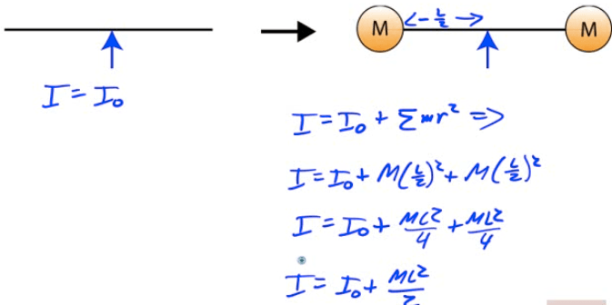

Types of Inertia
================

-   Inertial mass / translational inertia (M) is an object's ability to resist a linear acceleration

-   Moment of Inertia / rotational inertia (I) is an object's resistance to a rational acceleration

-   Objects that have most of their mass near their axis of rotation have smaller rotational inertias than objects with more mass farther from their axis of rotation

Kinetic Energy of a Rotating Disc
=================================

  

Calculating Moment of Inertia (I)
=================================

-   

  

Example 1: Point Masses
=======================

-   Find the moment of inertia (I) of two 5-kg bowling balls joined by a meter-long rod of negligible mass when rotated about the center of the rod.

-   Compare this to the moment of inertia of the object when rotated about one of the mass

  

Example 2: Uniform Rod
======================

-   Find the moment of inertia of a uniform rod about its end and about its center

  

Example 3: Solid Cylinder
=========================

-   Find the moment of inertia of a uniform solid cylinder about its axis

  

Parallel Axis Theorem (PAT)
===========================

-   If the moment of inertia (I) of any object through an axis intersecting the center of mass of the object is l, you can find the moment of inertia around any axis parallel to the current axis of rotation (l')

  

  

Example 4: Calculating I Using PAT
==================================

-   Find the moment of inertia of a uniform rod about its end

  

Example 5: Hollow Sphere
========================

-   Calculate the moment of inertia of a hollow sphere with a mass of 10 kg and a radius of 0.2 meter

  

Example 6: Adjusting Moment of Inertia
======================================

-   A uniform rod of length L has moment of inertia I0</sub  when rotated about its midpoint.

-   A sphere of mass M is added to each end of the rod.

-   What is the new moment of inertia of the rod/ball system?

  