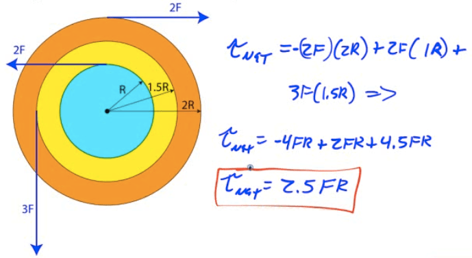

Torque (τ)
==========

-   Torque is a force that causes an object to turn

-   Torque must be perpendicular to the displacement to cause a rotation

-   The further away the force is applied from the point of rotation, the more leverage you obtain, so this distance is known as the lever arm (r)

  

-   

-   

Direction of the Torque Vector
==============================

-   The direction of the torque vector is perpendicular to both the position vector and the force vector

-   You can find the direction using the right-hand rule. Point the fingers of your right hand in the direction of the line of action, and bend you fingers in the direction of the force

-   You thumb then points in the direction of your torque

-   Note that positive torques cause counter-clockwise rotation, and negative torques cause clockwise rotation

Newton's Second Law: Translational vs. Rotational
=================================================

-   

-   

Equilibrium
===========

-   Static Equilibrium implies that the net force and the net torque are zero, and the system is at rest

-   Dynamic Equilibrium implies that the net force and the net torque are zero, and the system is moving at constant translational and rotational velocity

Example 1: See-Saw Problem
==========================

-   A 10-kg tortoise sits on a see-saw 1 meter from the fulcrum.

-   Where must a 2-kg hare sit in order to maintain static equilibrium?

-   What is the force on the fulcrum?

  

Example 2: Beam Problem 
========================

-   

-   Find the beam's angular acceleration

  

  

Example 3: Pulley with Mass
===========================

-   A light string attached to a mass m is wrapped around a pulley of mass mp</sub  and radius R. Find the acceleration of the mass

  

  

  

Example 4: Net Torque
=====================

-   A system of three wheels fixed to each other is free to rotate about an axis through its center. Forces are exerted on the wheels as shown. What is the magnitude of the net torque on the wheels?

  

Example 5: Café Sign
====================

-   A 3-kg café sign is hung from a 1-kg horizontal pole as shown. A wire is attached to prevent the sign from rotating.

-   Find the tension in the wire

  

2008 Free Response Question 2
=============================

  

  

  

  