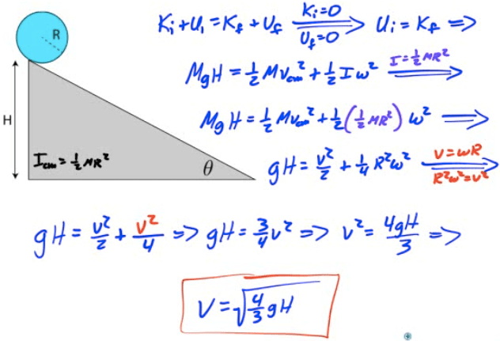
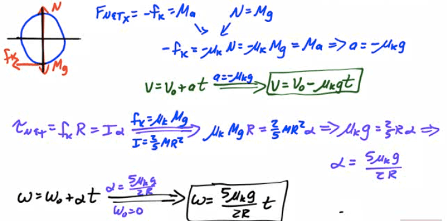
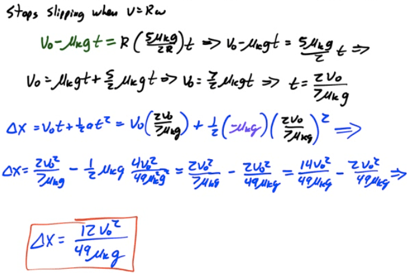
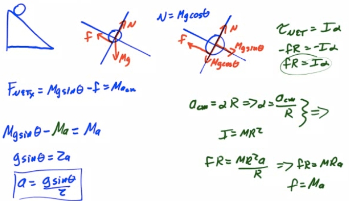

Conservational of Energy
========================

  

Example 1: Disc Rolling Down an Incline
=======================================

-   Find the speed of a disc of radius R which starts at rest and rolls down an incline of height H

  

Rotational Dynamics
===================

  

Example 2: Strings with Massive Pulleys
=======================================

-   Two blocks are connected by a light string over a pulley of mass mp210. Find the distance the ball skids before rilling given a coefficient of kenetic friction μk

  

  

Example 5: Amusement Park Swing
===============================

-   An amusement park ride of radius x allows children to sit in a spinning swing held by a cable of length L.

-   At maximum angular speed, the cable makes an angle of θ with the vertical as shown in the diagram below

-   Determine the maximum angular speed of the rider in terms of g, θ, x and L.

  

  

2002 Free Response Question 2
=============================

  

  

2006 Free Response Question 3
=============================

  

  

  

2010 Free Response Question 2
=============================

  

  

  

2013 Free Response Question 3
=============================

  

  

  