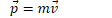
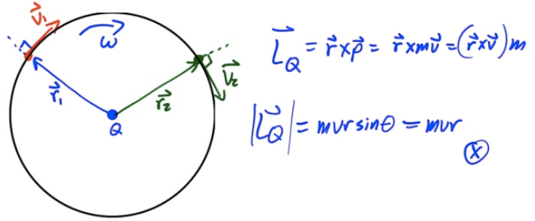
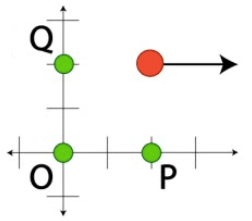
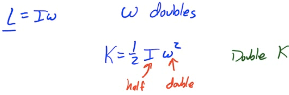
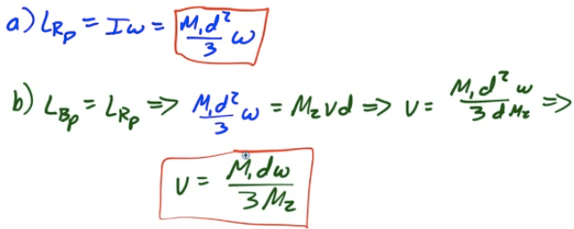
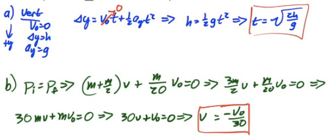

Linear Momentum
===============

-   Momentum is a vector describing how difficult it is to stop a moving object

-   Total momentum is the sum of individual momenta

-   

-   Units are kg·m/s or N·s

Angular Momentum
================

-   

-   Total angular momentum is the sum of individual angular momenta

-   

-   Units are kg·m2/s

Calculating Angular Momentum
============================

-   

  

Spin Angular Momentum
=====================

-   For an object rotating about its center of mass

    -   

-   This is known as an object's spin angular momentum

-   Spin angular momentum is constant regardless of your reference point

Example 1: Object in Circular Orbit
===================================

-   Find the angular momentum of a planet orbiting the sun. Assume a perfectly circular orbit

  

Example 2: Angular Momentum of a Point Particle
===============================================

  

-   Find the angular momentum for a 5-kg point particle located at (2,2) with a velocity of 2 m/s east

-   About point O at (0,0)

  

-   About point P at (2,0)

  

-   About point Q at (0,2)

  

Angular Momentum and Net Torque
===============================

  

Conservation of Angular Momentum
================================

-   Spin angular momentum, the product of an object's moment of inertia and its angular velocity about the center of mass, is conserved in a closed system with no external net toques applied

    -   

Example 3: Ice Skater Problem
=============================

-   An ice skater spins with a specific angular velocity. She brings her arms and legs closer to her body, reducing her moment of inertia to half its original value. What happens to her angular velocity? What happens to her rotational kinetic energy?

  

Example 4: Combining Spinning Discs
===================================

-   A disc with moment of inertia 1 km·m222

-   What is Angelina's angular velocity after catching the exercise ball? (Neglect any external torque from the ball)

  

2005 Free Response Question 3
=============================

  

  

  

2014 Free Response Question 3
=============================

  

  

  

  