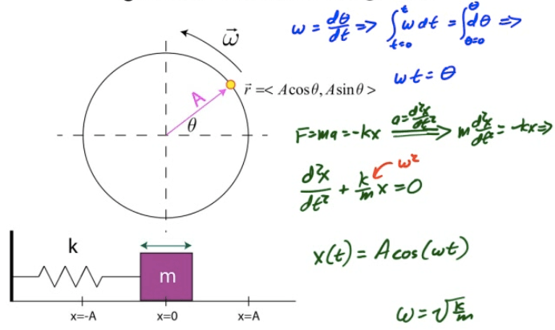
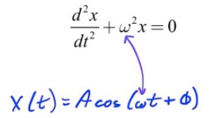
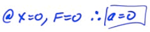
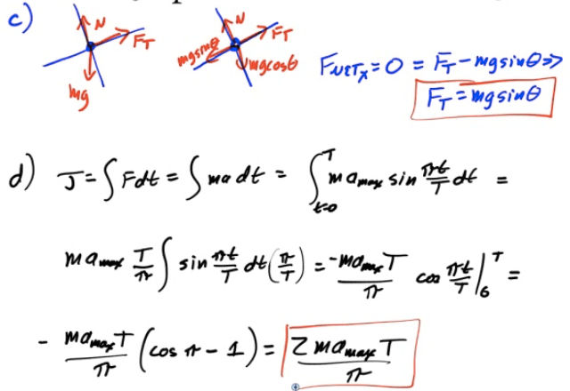

Simple Harmonic Motion
======================

-   Simple harmonic motion (SHM) is motion in which a restoring force is directly proportional to the displacement of an object

-   Nature's response to a perturbation or disturbance is often SHM

Circular Motion vs. SHM
=======================

  

Position, Velocity, Acceleration
================================

  

Frequency and Period
====================

-   Frequency

    -   Frequency is the number of revolutions or cycles which occur each second

    -   Symbol is f

    -   Units are 1/s, or Hertz (Hz)

    -   

-   Period

    -   Period is the time it takes for one complete revolution, or cycle.

    -   Symbol is T

    -   Unites are seconds (s)

    -   T = time for 1 cycle = time for 1 revolution

-   Relationship

    -   

    -   

Angular Frequency
=================

-   Angular frequency is the number of radians per second, and it corresponds to the angular velocity for an object traveling in uniform circular motion

-   Relationship

    -   

    -   

    -   

Example 1: Oscillating System
=============================

-   An oscillating system is created by a releasing an object from a maximum displacement of 0.2 meters. The object makes 60 complete oscillations in one minute

-   Determine the object's angular frequency

  

-   What is the object's position at time t=10s?

  

-   At what time is the object at x=0.1m?

  

Mass on a Spring
================

  

Example 2: Analysis of Spring-Block System
==========================================

-   A 5-kg block is attached to a 2000 N/m spring as shown and displaced a distance of 8 cm from its equilibrium position before being released.

-   Determine the period of oscillation, the frequency, and the angular frequency for the block

  

General Form of SHM
===================

  

Graphing SHM
============

  

Energy of SHM
=============

-   When an object undergoes SHM, kinetic and potential energy both vary with time, although total energy (E=K+U) remains constant

  

Horizontal Spring Oscillator
============================

  

Vertical Spring Oscillator
==========================

  

Springs in Series
=================

  

Springs in Parallel
===================

  

The Pendulum
============

-   A mass m is attached to a light string that swings without friction about the vertical equilibrium position

  

Energy and the Simple Pendulum
==============================

  

  

Frequency and Period of a Pendulum
==================================

  

Period of a Physical Pendulum
=============================

  

Example 3: Deriving Period of a Simple Pendulum
===============================================

  

Example 4: Deriving Period of a Physical Pendulum
=================================================

  

Example 5: Summary of Spring-Block System
=========================================

  

Example 6: Harmonic Oscillator Analysis
=======================================

-   A 2-kg block is attacked to a spring. A force of 20 N stretches the spring to a displacement of 0.5 meter

-   The spring constant

  

-   The total energy

  

-   The speed at the equilibrium position

  

-   The speed at x=0.30 meters

  

-   The speed at x=-0.4 meters

  

-   The acceleration at the equilibrium position

  

-   The magnitude of the acceleration at x=0.5 meters.

  

-   The net force at equilibrium position

  

-   The net force at x=0.25 meter

  

-   Where does kinetic energy = potential energy

  

Example 7: Vertical Spring Block Oscillator
===========================================

  

-   A 2-kg block attached to an un-stretched spring of spring constant k=200 N/m as shown in the diagram below is released from rest. Determine the period of the block's oscillation and the maximum displacement of the block from its equilibrium while undergoing simple harmonic motion.

  

2009 Free Response Question 2
=============================

  

  

  

2010 Free Response Question 3
=============================

  

  

  

  