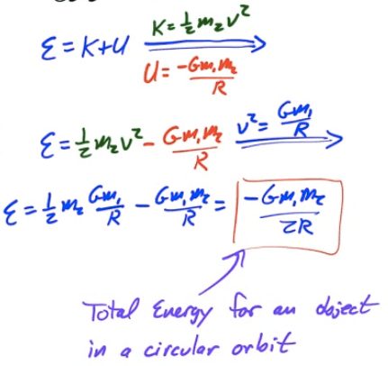

Newton's Law of Universal Gravitation
=====================================

  

Gravitational Field Strength
============================

  

Gravitational Field of a Hollow Shell
=====================================

-   Inside a hollow sphere, the gravitational field is 0. Outside a hollow sphere, you can treat the sphere as if it's entire mass was concentrated at the center, and then calculate the gravitational field

  

Gravitational Field Inside a Solid Shell
========================================

-   Outside a solid sphere, treat the sphere as if all the mass is at the center of the sphere. Inside the sphere, treat the sphere as if the mass inside the radius is all at the center. Only the mass inside the "radius of interest" counts

  

Velocity in Circular Orbit
==========================

  

Period and Frequency for Circular Orbits
========================================

  

Mechanical Energy for Circular Orbits
=====================================

  

Escape Velocity
===============

  

Kepler's Frist Law of Planetary Motion
======================================

-   The orbits of planetary bodies are ellipses with the sun at one of two foci of the ellipse

  

Kepler's Second Law of Planetary Motion
=======================================

-   If you were to draw a line from the sun to the orbiting body, the body would sweep out equal areas along the ellipse in equal amounts of time.

  

Kepler's Third Law of Planetary Motion
======================================

-   The ratio of the squares of the periods of two planets is equal to the ratio of the cubes of their semi-major axes.

-   The ratio of the squares of the periods to the cubes of their semi-major axes is referred to as Kepler's Constant

  

Total Mechanical Energy for an Elliptical Orbit
===============================================

  

Velocity and Radius for an Elliptical Orbit
===========================================

  

Example 1: Rocket Launched Vertically
=====================================

-   A rocket is launched vertically form the surface of the Earth with an initial velocity of 10 km/s. What maximum height does it reach, neglecting air resistance?

-   Note that the mass of the Earth (m1) is 6\*1024E) is 6.37\*106</sup  m. You may not assume that the acceleration due to gravity is constant.

  

2007 Free Response Question 2
=============================

  

  

  