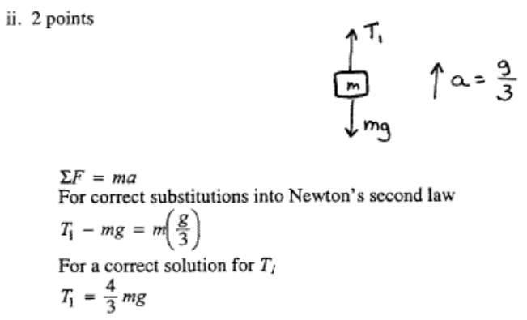
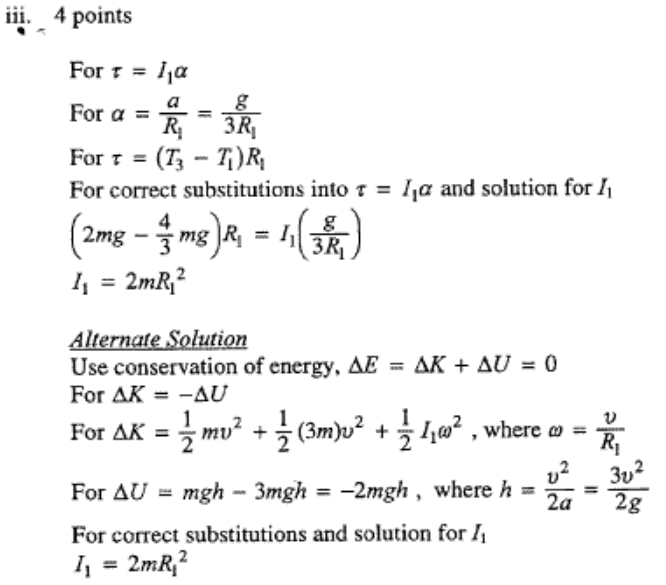
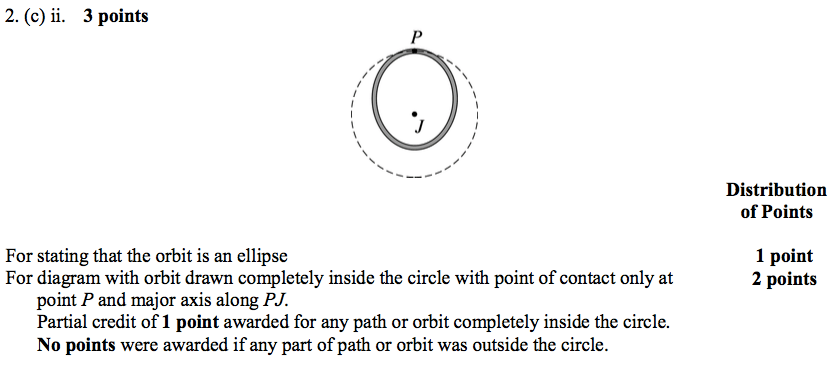
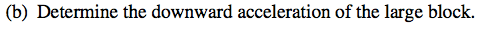
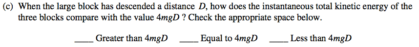

1999 Free Response
==================

Question 3
----------

  

  

  

  

2000 Free Response
==================

Question 2
----------

  

  

  

  

  

2001 Free Response
==================

Question 2
----------

  

  

  

Question 3
----------

  

  

  

  

  

  

  
