2002 Free Response
==================

Question 2
----------

  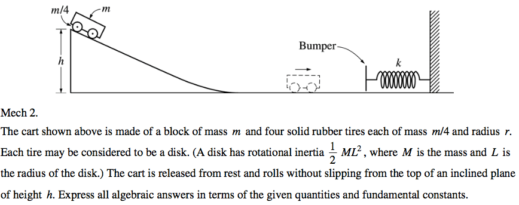

  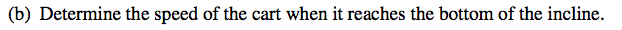

  

Question 3
----------

  

  

2003 Free Response
==================

Question 2
----------

  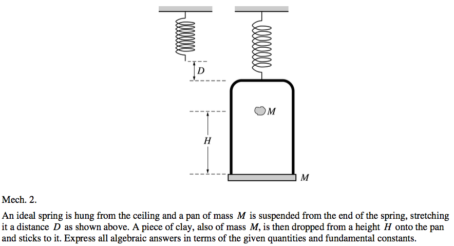

  

  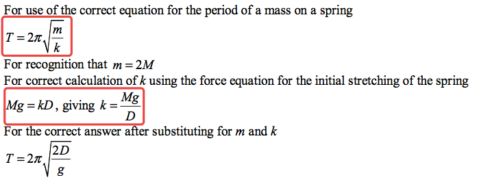

Question 3
----------

  

  

  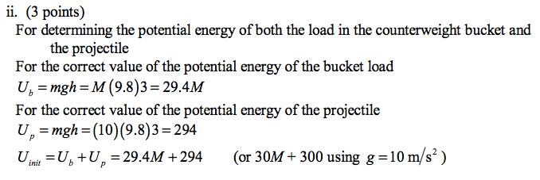

  

2004 Free Response
==================

Question 1
----------

  

  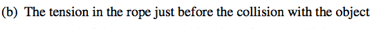

  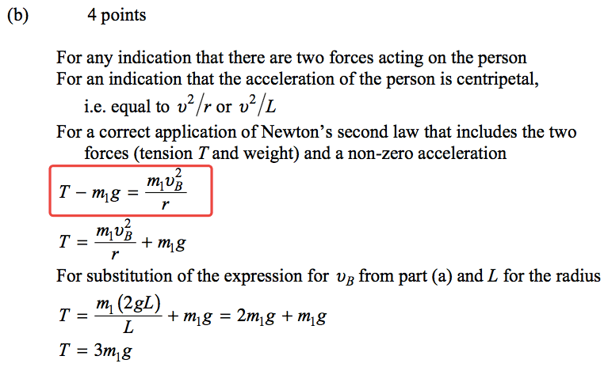

  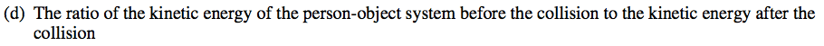

  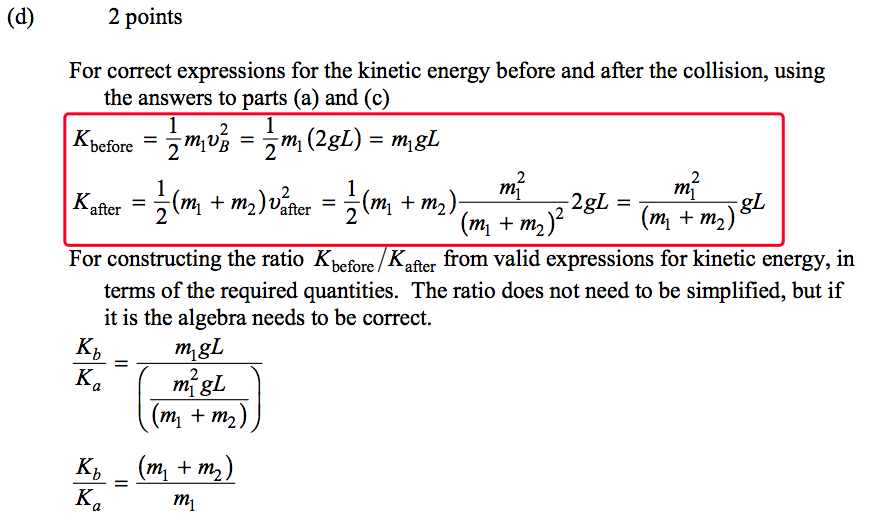

  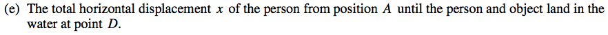

  

Question 3
----------

  

  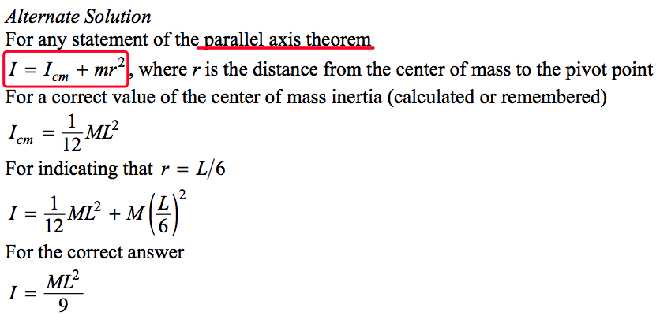

  

  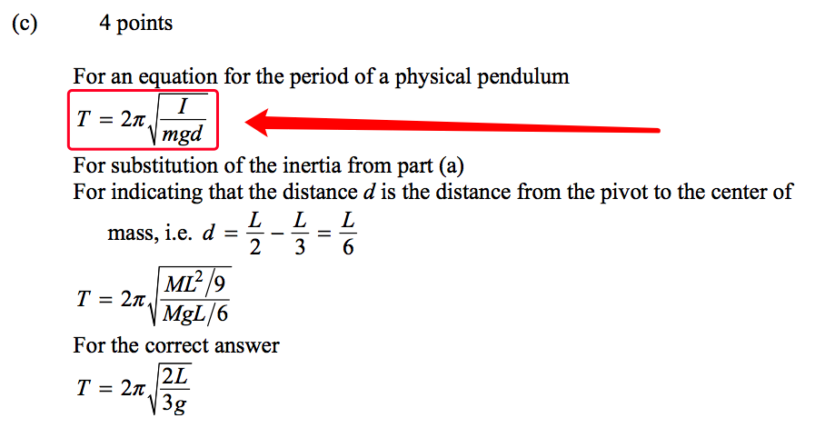

  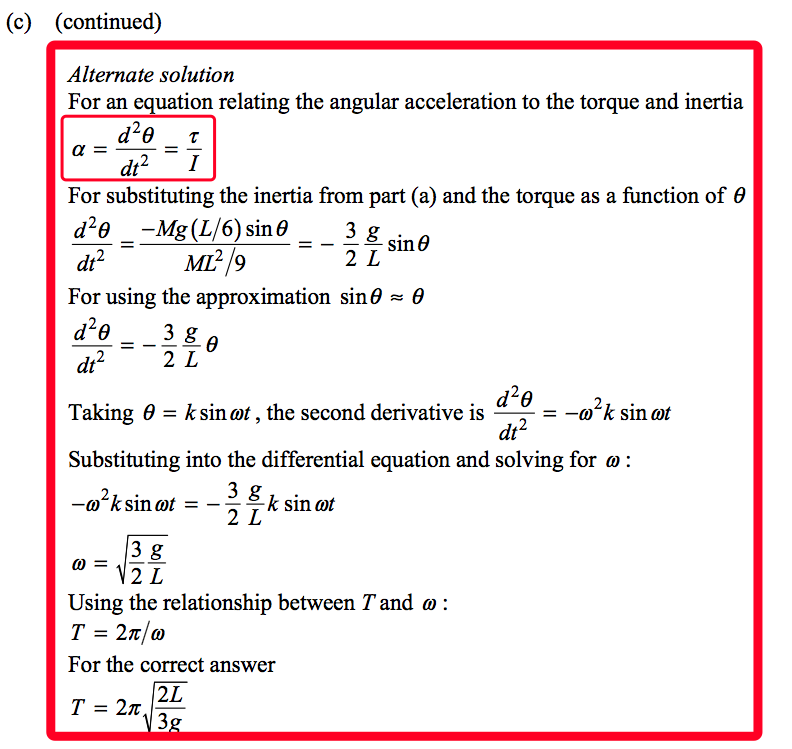

 