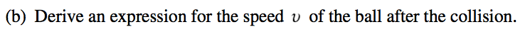
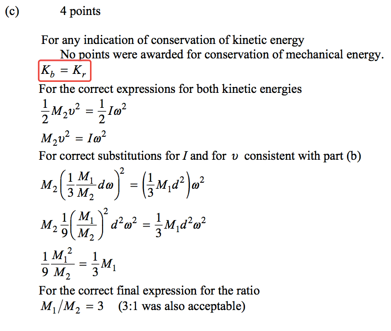

2005 Free Response
==================

Question 3
----------

  

  

  

  

  

  

  

2006 Free Response
==================

Question 3
----------

  

  

  

  

2007 Free Response
==================

Question 2
----------

  

  

  