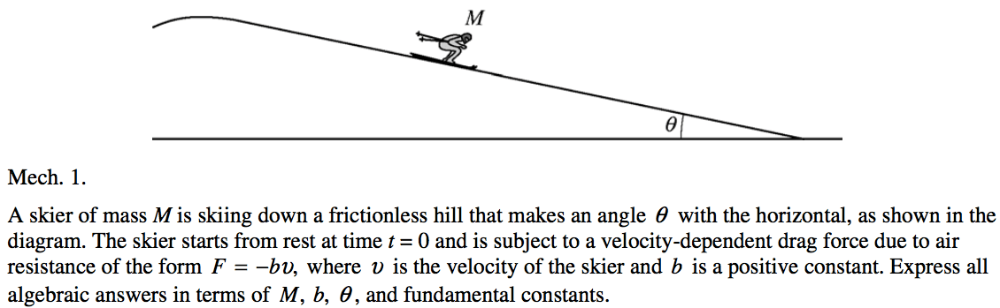
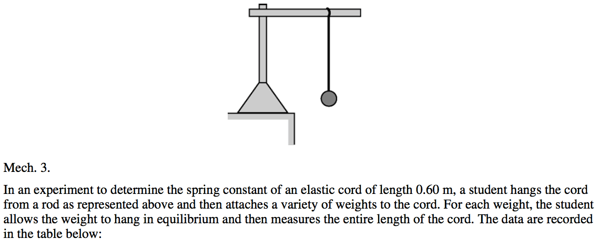

2008 Free Response
==================

Question 1
----------

  

  

  

Question 3
----------

  

  

  

  

2009 Free Response
==================

Question 1
----------

  

  

Question 2
----------

  

  

  

2010 Free Response
==================

Question 3
----------

  

  

  

  

  