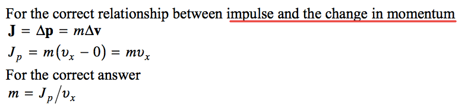
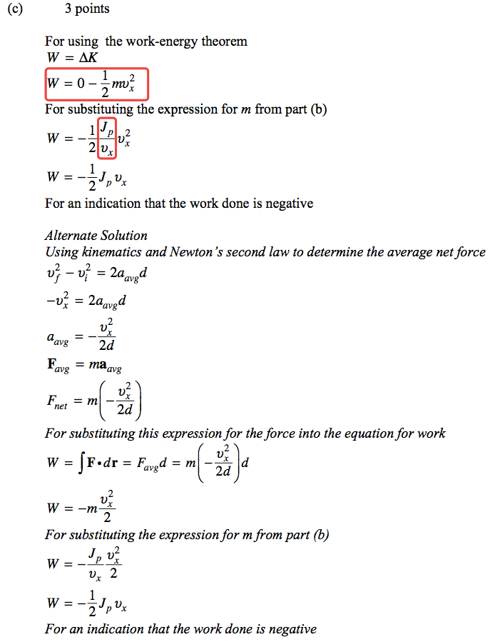
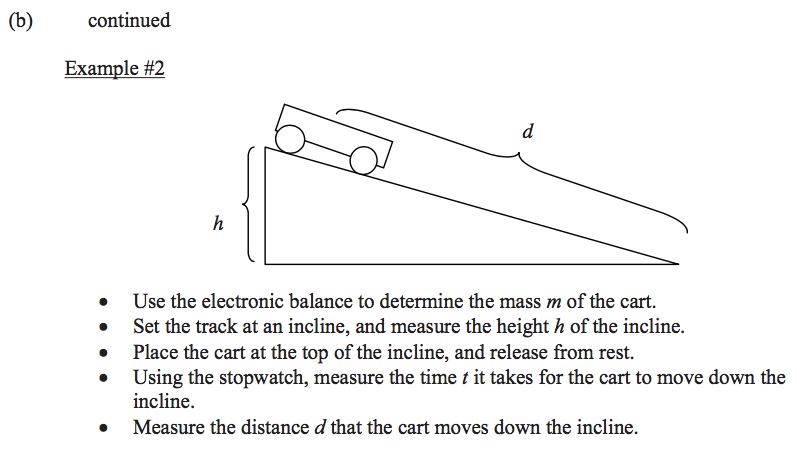

2011 Free Response
==================

Question 1
----------

  

  

  

  

  

  

  

2012 Free Response
==================

Question 2
----------

  

  

  

  

  

Question 3
----------

  

  

  

2013 Free Response
==================

Question 3
----------

  

  

  

  

  

   
