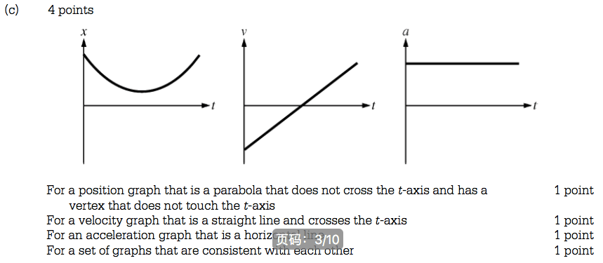
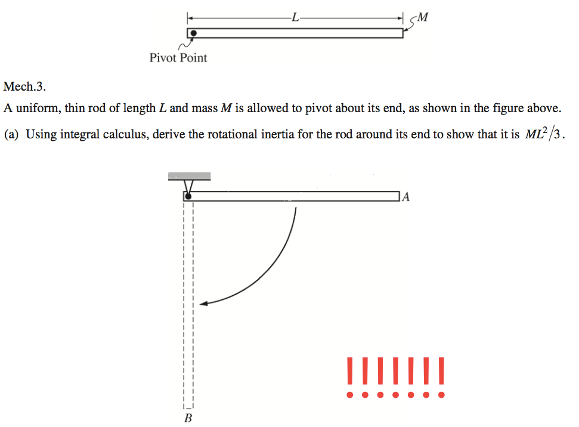
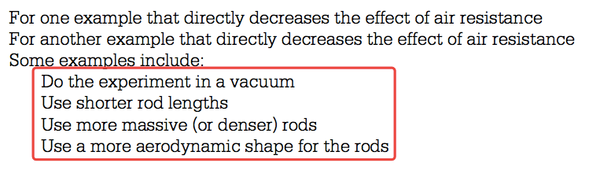
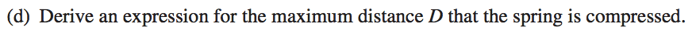

2014 Free Response
==================

Question 1
----------

  

  

  

Question 2
----------

  

  

  

Question 3
----------

  

  

  

  

  

2015 Free Response
==================

Question 1
----------

  

  

  

  

  

Question 3
----------

  

  

  

  

  

  

2016 Free Response
==================

Question 2
----------

  

  

  

  

  