Sample Questions

Wednesday, April 5, 2017

5:57 PM

 

Question 6
==========

  

  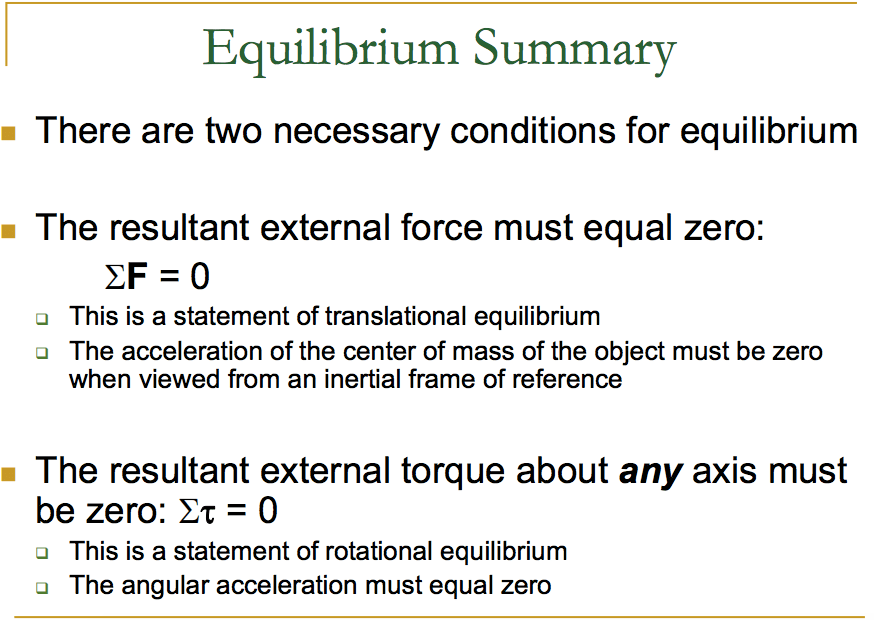

 

 

1998 Multiple Choice

Thursday, March 23, 2017

11:00 PM

 

Question 17
===========

  

Question 20
===========

  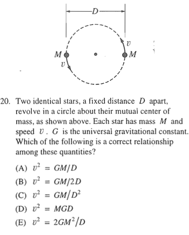

  

Question 33
===========

  

  

 

 

2004 Multiple Choice

Wednesday, April 19, 2017

12:58 AM

 

Question 8
==========

  

  

Question 17
===========

  

-   No net external torque --&gt; no change in angular momentum

-   No net external force --&gt; no change in linear momentum

Question 25
===========

  

-   After ball tossed it has momentum toward back so the boat must have forward momentum to maintain the zero initial momentum.

-   After the catch both the ball and boat the two must be at the same speed and this must be at rest to have momentum zero as it was originally

Question 29
===========

  

-   Neither the mass, M, nor the spring constant, k, depend on the gravitational force of the planet.

Question 33
===========

  

  

  

Question 34
===========

  

-   The path of a point on the rim of a non-slipping rolling wheel is a cycloid.

  

Question 35
===========

-   Escape speed

  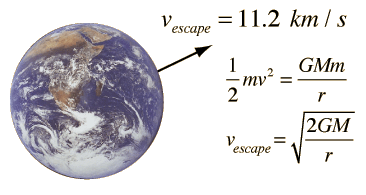

-   Orbital speed

  

 

 

2009 Multiple Choice

Wednesday, April 19, 2017

1:11 AM

 

Question 7
==========

  

Question 11
===========

  

  

Question 19
===========

  

-   When a=0, μ= tanθ

Question 21
===========

  

-   After the person has walked to the other end, the situation must be the mirror image of this one; the center of mass will be shifted to a distance d to the left of the center of the raft.

-   But the center of mass cannot move as the person walks on the boat.

-   Therefore, the boat must have moved a distance 2d to the right.

Question 24
===========

  

  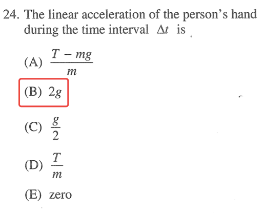

  

Question 25
===========

  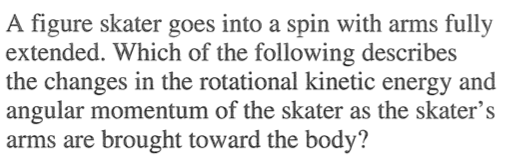

  

Question 32
===========

  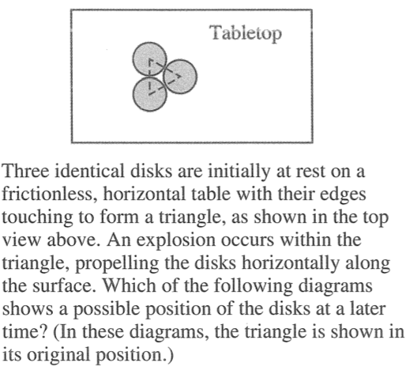

-   The center of mass cannot move

 

 

Free Response 1999-2001

2017年5月8日 星期一

上午1:38

 

1999 Free Response
==================

Question 3
----------

  

  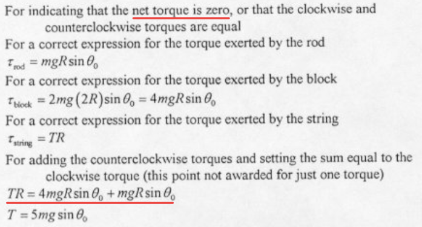

  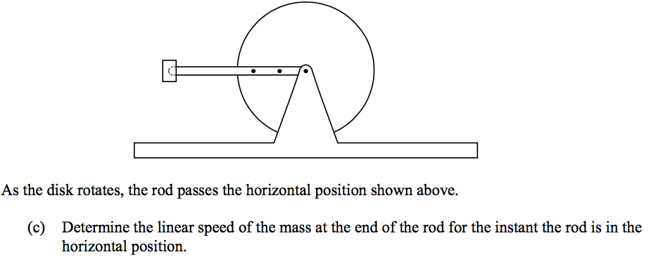

  

2000 Free Response
==================

Question 2
----------

  

  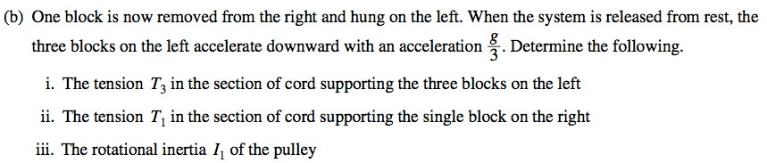

  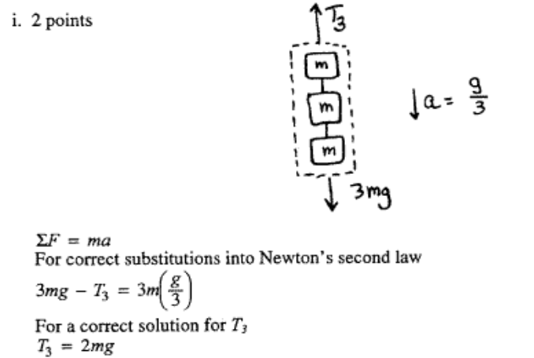

  

  

2001 Free Response
==================

Question 2
----------

  

  

  

Question 3
----------

  

  

  

  

  

  

  

 

 

Free Response 2002-2004

2017年5月8日 星期一

上午1:38

 

2002 Free Response
==================

Question 2
----------

  

  

  

Question 3
----------

  

  

2003 Free Response
==================

Question 2
----------

  

  

  

Question 3
----------

  

  

  

  

2004 Free Response
==================

Question 1
----------

  

  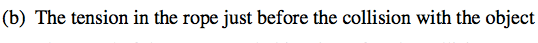

  

  

  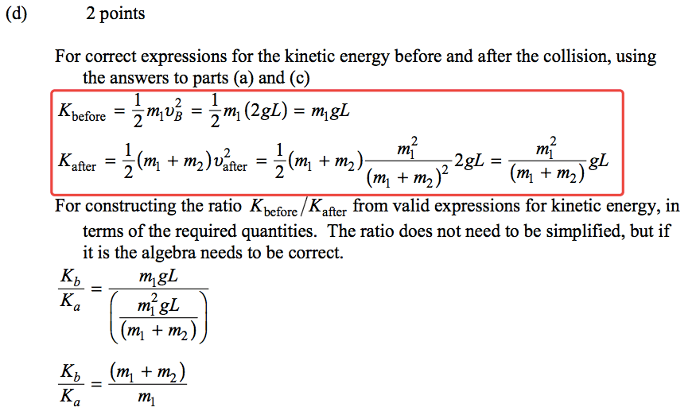

  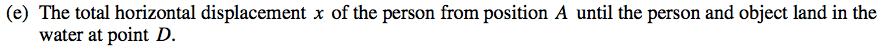

  

Question 3
----------

  

  

  

  

  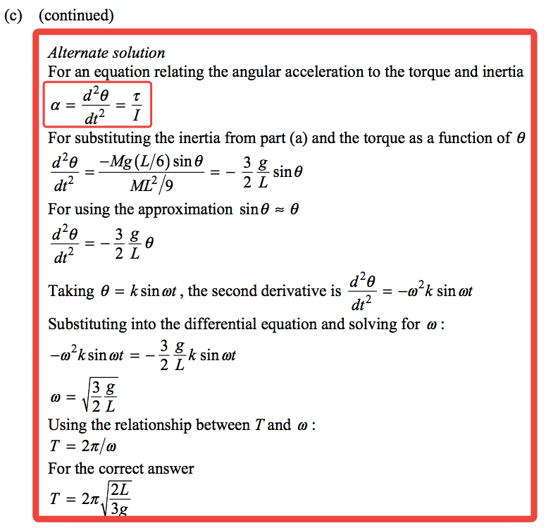

 

 

Free Response 2005-2007

2017年5月8日 星期一

上午1:38

 

2005 Free Response
==================

Question 3
----------

  

  

  

  

  

  

  

2006 Free Response
==================

Question 3
----------

  

  

  

  

2007 Free Response
==================

Question 2
----------

  

  

  

   

 

 

Free Response 2008-2010

2017年5月8日 星期一

上午1:38

 

2008 Free Response
==================

Question 1
----------

  

  

  

Question 3
----------

  

  

  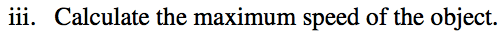

  

2009 Free Response
==================

Question 1
----------

  

  

Question 2
----------

  

  

  

2010 Free Response
==================

Question 3
----------

  

  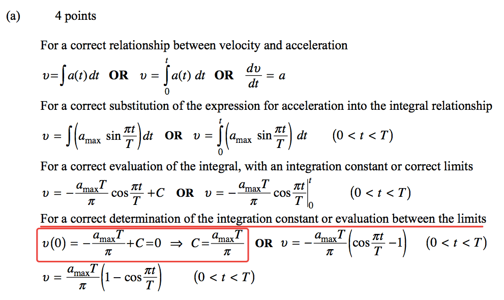

  

  

  

 

 

Free Response 2011-2013

2017年5月8日 星期一

上午1:38

 

2011 Free Response
==================

Question 1
----------

  

  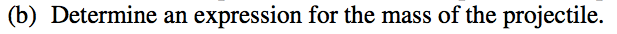

  

  

  

  

  

2012 Free Response
==================

Question 2
----------

  

  

  

  

  

Question 3
----------

  

  

  

2013 Free Response
==================

Question 3
----------

  

  

  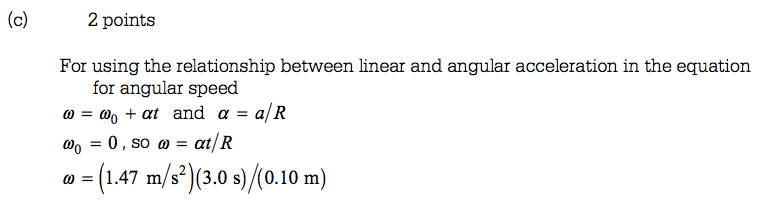

  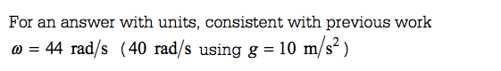

  

   

 

 

Free Response 2014-2016

2017年5月8日 星期一

上午1:38

 

2014 Free Response
==================

Question 1
----------

  

  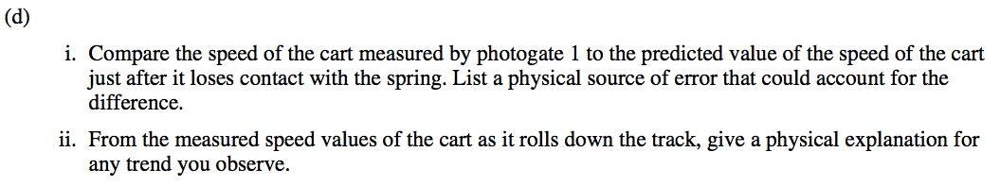

  

Question 2
----------

  

  

  

Question 3
----------

  

  

  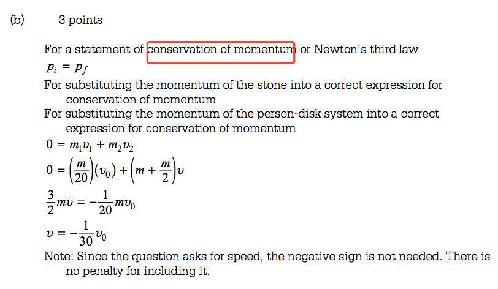

  

  

2015 Free Response
==================

Question 1
----------

  

  

  

  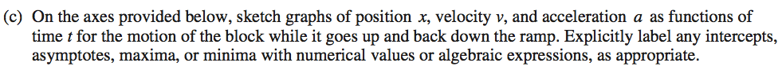

  

Question 3
----------

  

  

  

  

  

  

2016 Free Response
==================

Question 2
----------

  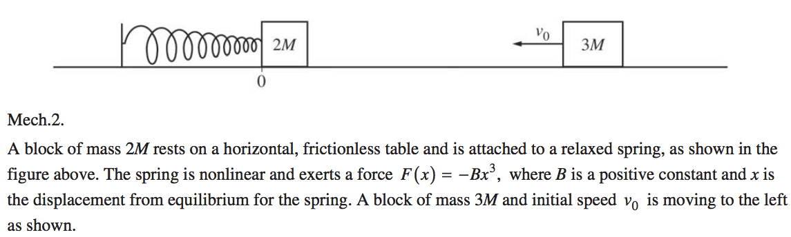

  

  

  

  
